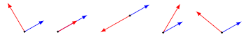

# 📝Definition
**📄Definition 1**
angle between two nonzero vectors $a, b$ defined as
$$
\begin{align}
\angle(a,b)=\arccos\bigg(\frac{a^Tb}{\lVert a\rVert\lVert b\rVert}\bigg)
\end{align}
$$
> [!info] Remark
> $\angle(a,b)$ is the number in $[0,\pi]$ that satisfies
> $$a^Tb=\lVert a\rVert\lVert b\rVert\cos(\angle(a,b))$$

___
**📑Definition 2**
Given two $n$-dimensional vectors $P$ and $Q$, the [[Inner Product|dot product]] $P\cdot Q$ satisfies the equation. $a$ is the angle between $P$ and $Q$.
$$
P\cdot Q = \lVert P\rVert\cdot\lVert Q\rVert\cos{a}
$$
___
**📃Definition 3**
The angle $u$ between two *nonzero* vectors $u = \left<u_1, u_2, u_3\right>$ and $v = \left<v_1, v_2, v_3\right>$ is given by
$$
\theta=\cos^{-1}\left(\frac{u_1 v_1+u_2 v_2+u_3 v_3}{\left|\mathbf{u}\right|\left|\mathbf{v}\right|}\right).
$$

# 🧠Intuition
**Fact**:  in light of theorem: if two vector $P\cdot Q=0$, they are **orthogonal**.
**Fact**: $P\cdot Q>0$, they are **on the same side**.  $P\cdot Q<0$, they are **on the opposite side**.

# 📈Diagram
Let $\theta$ denote the angle between vector $a,b$

From left to right are the angles stated above.
- $\theta=\pi/2=90\degree$
- $\theta=0$: $a$ and $b$ are aligned $(a^Tb=\lVert a\rVert\lVert b)$
- $\theta=\pi=180\degree$: $a$ and $b$ are anti-aligned $(a^Tb=-\lVert a\rVert\lVert b)$
- $\theta\leq\pi/2=90\degree$: $a$ and $b$ make an acute angle $(a^Tb\geq0)$
- $\theta\geq\pi/2=90\degree$: $a$ and $b$ make an obtuse angle $(a^Tb\leq0)$

# 🗃Example
Example is the most straightforward way to understand a mathematical concept.

# 🗿Socratic Method
- **💬Question**: why (1)the equation is able to measure angle and (2)$v\cdot w=0$ means they are perpendicular.
- **✍Argument**:
	- (1)Explain the equation
		- (1.1) talk about angle between [[vector#^2961cac03e778f19|unit vector]]
			- See it in the picture of [[unit circle]]. Then the vector $v,w$ can be written as the followed
				- 
			- Therefore the dot product between $v,w$ are
				- $$
				  \begin{align}
				  v\cdot w=\begin{bmatrix}\cos\beta\\\sin\beta\end{bmatrix}\cdot\begin{bmatrix}\cos\alpha\\\sin\alpha\end{bmatrix}=\cos\alpha\cos\beta+\sin\alpha\sin\beta=\cos(\beta-\alpha)
				  \end{align}
				  $$
			- Since $\cos$ is an [[function#^49e41254c30b3ba8|even function]]. The following is the same. It means that the order doesn't matter and we **only care about the difference between 2 angles**(a.k.a. $\theta$).
				- $$
				  \cos(\beta-\alpha)=\cos(\alpha-\beta)=\cos\theta
				  $$
		- (1.2) Extend the generality of the definition from unit vector
			- Because every vector can be converted to unit vector by [[vector#^6b2cad614774359d|vector nomalization]]. Therefore we can
				- 1️⃣ normalize it. $v$ becomes $\hat{v}=\frac{v}{\lVert v\rvert}$, $w$ becomes $\hat{w}=\frac{w}{\lVert w\rvert}$
				- 2️⃣ dot product. $\hat{v}\cdot\hat{w}$
				
			- To conclude, the cosine of angle for any 2 vectors(except zero vector) can be written as
			- $$
			  \cos\theta=\frac{v\cdot w}{\lVert v\rVert\lVert w\rVert}
			  $$
			- Using the [[Trigonometric Function#inverse cosine|inverse of cosine]], we have
				- $$
				  \theta=\arccos{\bigg(\frac{v\cdot w}{\lVert v\rVert\lVert w\rVert}\bigg)}
				  $$
	- (2) Because $\theta=\pi/2=\arccos{0}$
- **📜Key Takeaway**: Think about it in unit circle!

# 🌱Related Elements
The closest pattern to current one, what are their differences?

# 🍂Unorganized