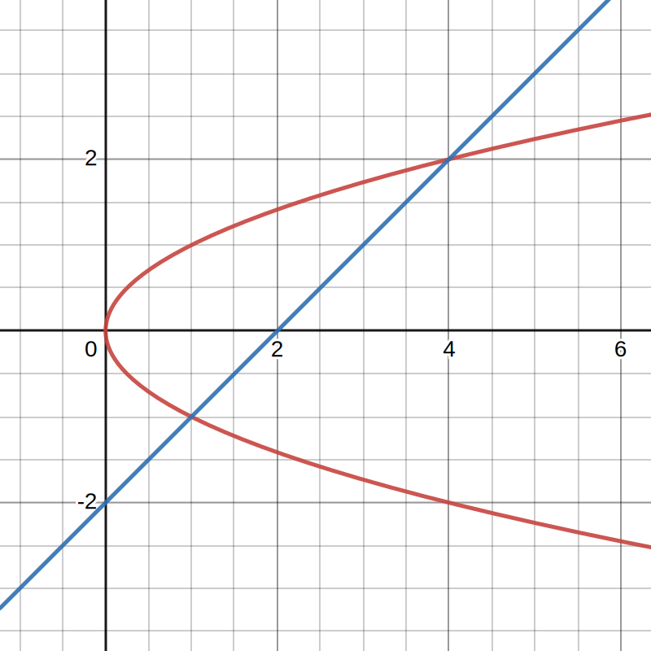
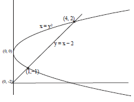
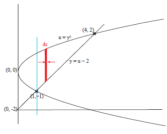
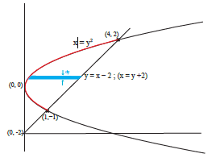
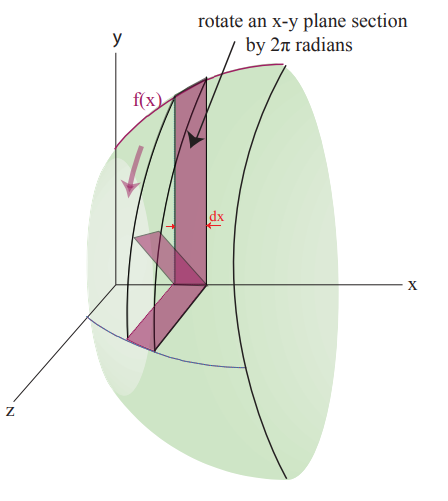

# Areas between two curves
## 📝Definition
This is a classifc application using [[definite integral]] and [[First Fundamental Theorem of Calculus|FTC1]].
$$
A = \int_a^b(f(x)-g(x))dx
$$
![[Finding the area between two curves.png]]

## 🗃Example
### 📌Example 1
- 💬Question: Find the area in the region between $x = y^2$ and $y = x − 2$.
	- 
- 🏹Strategy: Generally, there are 2 ways of solving this question.
	- Hard Way: Vertical Slices
	- Easy Way: Horizontal Slices
- ✏Solution: 
	- General setup
		- First, solving the equations
			- $$\begin{align}y+2&=x=y^2\\y^2-y-2&=0\\(y − 2)(y + 1)&=0\end{align}$$
			- Crossing points at $y = −1, 2$. Plug these back in to find the associated $x$ values, $x = 1$ and $x = 4$.Thus the curves meet at $(1,−1)$ and $(4, 2)$
		- Second, graph these functions and find the crossing points
			- 
	- Hard Way: Vertical Slices
		- If we slice the region between the two curves vertically, we need to consider two different regions.
			- 
		- Region $[0,1]$
			- This region is tricky because $x=y^2$ is not a function in terms of $x$, simply because there are 2 values of that function. see the [[function#📝Definition|the definition of function]].
			- Therefore, we need to split the function into 2 half, which are $\sqrt{x},-\sqrt{x}$.
		- Region $[1,4]$
			- Nothing special, just the area between 2 curves.
		- Integrate the difference between the top curve and the bottom curve in each region
			- $$A=\int_0^1\{\sqrt{x}-(-\sqrt{x})\}dx+\int_1^4\{\sqrt{x}-(x-2)\}dx=\int{(y_{top}-y_{bottom})}dx$$
	- Easy Way: Horizontal Slices
		- Seeing the curve from another perspective, we have
			- 
		- Then the result is easy.
			- $$\int{(x_{left}-x_{right})}dy=\int_{y=-1}^{y=2}[(y+2)-y^2]dx=(\frac{y^2}{2}+2y+\frac{-y^3}{3})\bigg|_{-1}^{2}=\frac{9}{2}$$

# Volumes of solids of revolution
## 📝Description
This application of volumes is to rotate $f(x)$ about the $x$-axis, coming out of the page, to get:

We want to figure out the volume of a “slice” of that solid. We can approximate each slice as a disk with width $dx$(thickness), radius $y$, and a cross-sectional area of $\pi y^2$. The volume of one slice is then:
$$
dV = \pi y^2dx
$$
(for a solid of revolution around the $x$-axis) Integrate with respect to $x$ to find the total volume of the solid of revolution.
## 🏹Strategy
There are 3 fundamental ways of solving the problem.
- [[Disc integration|disc method]]
- [[Shell integration|shell method]]
- [[washer method]]
## 🗃Example
See the following
![[Disc integration#📌Classic Sphere Volume]]

# Find the Centroid
See [[centroid]].

Transfer force to work using integration
See [[work#^9ccbf2]].