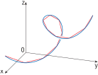

# 📝Definition
**📑Definition1**
The length of a plane curve with parametric equations $x = f(t), y=g(t), a \leq t \leq b$, as the [[limit]] of lengths of approximating polygonal paths and, for the case where $f'$ and $g'$ are [[continuity|continuous]], we arrived at the formula
$$
L=\int_a^b\sqrt{(\frac{dx}{dt})^2+(\frac{dy}{dt})^2}dt
$$

**📄Definition2**
The length of a smooth curve $\mathbf{r}(t) = x(t)\mathbf{i} + y(t)\mathbf{j} + z(t)\mathbf{k}, a \leq t \leq b$, that is traced exactly once as $t$ increases from $t = a$ to $t = b$, is
$$
L=\int_a^b\sqrt{(\frac{dx}{dt})^2+(\frac{dy}{dt})^2+(\frac{dz}{dt})^2}dt
$$
___

**📃Definition3**
More general definition
$$
\begin{align}
L&=\int_a^b \lVert\mathbf{r}'(t)\rVert dt\\
L&=\int_a^b \lVert\mathbf{v}\rVert dt\\
s&=\int_\gamma\lVert d\mathbf{\ell}\rVert\\
s&=\int_a^b \mathbf{v}(t)dt
\end{align}
$$
where
- $\mathbf{r}$ is a [[position vector]]
- $\mathbf{v}$ is a [[velocity vector]]
- $\gamma$ is a curve
- $d\mathbf{\ell}$ is a differential displacement vector along curve $\gamma$

___

> [!info] Remark
> Very interesting to compare these 3 definition side by side. The essence of them is only one - which is "approximating polygonal paths" in an infinitesimal sense.
> - Definition 1 helps you easy understand in $\mathbb{R}^2$ using [[Pythagorean Theorem]].
> - Definition 2 generalized it into $\mathbb{R}^3$.
> - Definition 3 is more abstract!

___
**📑Definition**
Now we suppose that $C$ is a curve given by a [[vector-valued function]]
$$
\mathbf{r}(t) = f(t)\mathbf{i} + g(t)\mathbf{j} + h(t)\mathbf{k}, a \leq t \leq b
$$
where $\mathbf{r}'$ is [[continuity|continuous]] and $C$ is traversed exactly once as $t$ increases from $a$ to $b$. We define its **arc length function** $s$ by
$$
s(t)=\int_a^t\lVert \mathbf{r}'(u) \rVert du=\int_a^t\sqrt{\left(\frac{df}{du}\right)^2+\left(\frac{dg}{du}\right)^2+\left(\frac{dh}{du}\right)^2}du
$$

**📃Definition4**
Given $t_0 \in I$ , the arc length of a [[smooth curve#⛈Characteristics#☁regular|regular parametrized curve]] $\alpha: I \to \mathbb{R}^3$, from the point $t_0$, is by definition
$$
s(t)=\int_{t_0}^t|\alpha '(t)|dt,
$$
where
$$
|\alpha '(t)|=\sqrt{(x'(t))^2+(y'(t))^2+(z'(t))^2}
$$
is the length of the vector $\alpha '(t)$.
> [!info] Remark
> Since $\alpha'(t)\neq0$, the arc length $s$ is a [[differentiable]] function of $t$ and $ds/dt=|\alpha '(t)|$.

# 🧠Intuition
Find an intuitive way of understanding this concept.

# 🗃Example
- 📁arc length example 1 ^a0b1ec
	- 💬Question: Find the length of the arc of the circular [[helix]] with vector equation $\mathbf{r}(t) = \cos t\mathbf{i} + \sin t\mathbf{j} + t\mathbf{k}$ from the point $(1, 0, 0)$ to the point $(1, 0, 2\pi)$.
	- 🏹Strategy:
		- a. Find what is the differential displacement
		- b. Find what is the integrated interval
	- ✏Solution:
		- Find the differential displacement.
			- Since we are given a [[position vector]], therefore what we need is its [[velocity vector]], a.k.a tangent / 1st derivative
				- then we have $\mathbf{r}'(t) = -\sin t\mathbf{i} + \cos t\mathbf{j} + 1\mathbf{k}$
			- Take the [[L2-norm|Euclidean Norm]] which you can think of it as doing the [[Pythagorean Theorem]] in $\mathbb{R}^3$.
				- $\lVert d\ell\rVert=\lVert \mathbf{r}'(t)\rVert=\sqrt{(-\sin t)^2+(\cos t)^2+(1)^2}=\sqrt{2}$
		- Now think about the interval to integrate.
			- This question is quite interesting since it doesn't tell you straight forward.
			- The trick is to focus on $\mathbf{k}$ which merely the $t$.
				- Therefore we could tell from the point $(1, 0, 0)$ to the point $(1, 0, 2\pi)$, the $t$ goes from $0$ to $2\pi$.
		- Finally we can integrate!
			- $L=\int_0^{2\pi}\lVert \mathbf{r}'(t)\rVert=\int_0^{2\pi}\sqrt{2}dt=2\sqrt{2}\pi$

- 📩arc length reparametrize example 1 ^696978
	- 💬Question: Reparametrize the helix $\mathbf{r}(t) = \cos t\mathbf{i} + \sin t\mathbf{j} + t\mathbf{k}$ with respect to arc length measured from $(1, 0, 0)$ in the direction of increasing $t$.
	- ✏Solution:
		- Understand what is $t_0$?
			- $(1,0,0)$ is equivalent to $t=0$ in $\mathbf{r}(t) = \cos t\mathbf{i} + \sin t\mathbf{j} + t\mathbf{k}$.
			- Therefore $t_0=0$
		- Find the arc length equation
			- $$\begin{align}s(t)&=\int_a^t\lVert \mathbf{r}'(u) \rVert du=\int_a^t\sqrt{\left(\frac{df}{du}\right)^2+\left(\frac{dg}{du}\right)^2+\left(\frac{dh}{du}\right)^2}du\\&=\int_0^t\sqrt{(-\sin t)^2+(\cos t)^2+1^2}du=\int_0^t\sqrt{2}du=\sqrt{2}t\end{align}$$
		- Change the variable with $s$ and $t$
			- $$\begin{align}s&=\sqrt{2}t\\t&=s/\sqrt{2}\end{align}$$
		- Plug $t=s/\sqrt{2}$ to the equation
			- $$\begin{align}\mathbf{r}(t) &= \cos t\mathbf{i} + \sin t\mathbf{j} + t\mathbf{k}\\\mathbf{r}(s(t)) &= \cos (s/\sqrt{2})\mathbf{i} + \sin (s/\sqrt{2})\mathbf{j} + (s/\sqrt{2})\mathbf{k}\end{align}$$
	- 🗣Note: The arc length parametrization is generally difficult to find analytically for a curve already given in terms of some other parameter t. Fortunately, however, we rarely need an exact formula for $s(t)$ or its inverse $t(s)$. Since this is just an **exercise** and you know what is reparameterization.

# 🌱Related Elements
The closest pattern to current one, what are their differences?

# 🍂Unorganized