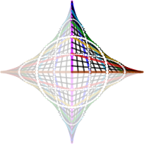

# 📝Definition

In #mathematics  , an astroid is a particular type of roulette curve: a hypocycloid with four cusps.

# ✒Notation
$$
\begin{align}
\displaystyle x^{\frac{2}{3}} + y^{\frac{2}{3}} = a^{\frac{2}{3}}
\end{align}
$$

# 📈Diagram

