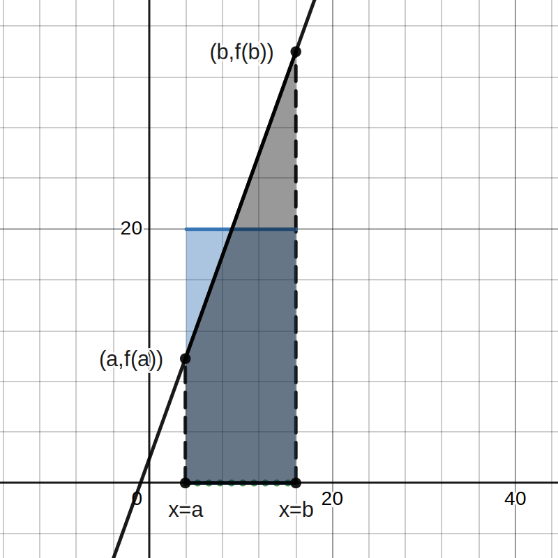

# 📝Definition
Normally, we refer the [[mean|arithmetic mean]] as the average.
In calculus, 
# ✒Notation
Arithmetic mean as average of 2 numbers, $a$ and $b$.
$$
\frac{a+b}{2}
$$

# 📈Diagram

# 🧬Related Elements
## MVT, FTC1, and average value
Let $F$ be a function that is differentiable for $a\leq x\leq b$.
The following are equivalent to
$$
\frac{F(b) - F(a)}{b-a}
$$
- average rate of change of $F$.
- average value of $F'$
- $\frac{1}{b-a} \int _a^b F' \, dx$
- $F'(c)$ for some $c$ in $(a,b)$

# 🏷(Sub)Categories
There are many similar terminologies related to "average".

## Average value of function
### 📝Definition
The average value of a function $f(x)$ on an interval $a\leq x\leq b$ is given by
$$
\text{Average}(f(x))=\displaystyle \frac{1}{b-a}\int _a^b f(x)\,  dx.
$$
### 📈Diagram

The blue rectangle is the average value of the integration of the function from $x=a$ to $x=b$.
### 🗃Example
📌Applying [[Second Fundamental Theorem of Calculus|FTC2]]
- 💬Question:
	- If the average value of $f(t)$ between $0$ and $x$ is given by the function $g(x)$:
		- $$g(x) = \frac{1}{x} \int _0^x f(t)\, dt.$$
- ✏Solution:
	- Multiple both sides with $x$, then we got the following.
	- $$\int _0^x f(t)dt = xg(x)\implies f(x)=g(x)+xg'(x)\text{ by FTC2.}$$

## Weighted average of function
### 📝Definition
The **weighted average** value of a function $f(x)$, weighted by a weight function $w(x)$ on an interval $a\leq x\leq b$ is given by
$$
\text{Weighted Average}(f(x))=\frac{\int _a^b f(x)w(x)\, dx}{\int _a^b w(x)\, dx}.
$$
### 🗣Descriptive Explanation
- Why this work?🤔
- We know the following
	- $$\text{Average}(C)=\frac{\int_{a}^{b}Cw(x)}{\int_{a}^{b}w(x)}=\frac{C\cancel{\int_{a}^{b}w(x)}}{\cancel{\int_{a}^{b}w(x)}}=C$$
	- where $C$ is a constant.
### 🗃Example
📌simple example
- 💬Question:
	- Compute the weighted average of the function $f(x) = \sin ^2 x$ weighted by $w(x) = \cos (x)$ over the interval $0 \leq x \leq \pi /4$.
- ✏Solution:
	- We apply the formula directly.
	- $$\begin{align}\frac{\int _0^{\pi /4} \sin ^2 x \cos x \, dx}{\int _0^{\pi /4} \cos x \, dx}&=\frac{\left.\sin ^3 x/3\right|_0^{\pi /4}}{\left. \sin x \right|_0^{\pi /4}}\\&=\displaystyle \frac{ (1/3)(1/2^{3/2})}{1/\sqrt{2}} = \frac16\end{align}$$

## Average rate of change
### 📝Definition
From knowledge of [[First Fundamental Theorem of Calculus|Fundamental Theorem of calculus]], we know that the average rate of change of $y$ over $a\leq t\leq b$ is the **same** as the average value of $y'$ over $a\leq t\leq b$.
$$
\text{ave}(y') = \frac{1}{b-a}\int _a^b y'(t)\, dt = \frac{y(b)-y(a)}{b-a} = \text{average rate of change of} y(t).
$$
