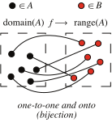

# 📝Definition
A [[Function|map]] is called bijective if it is both [[injective function|injective]] and [[surjective function|surjective]]. A bijective map is also called a bijection. A function $f$ admits an inverse $f^{-1}$ (i.e., "$f$ is invertible") if and only if it is bijective.

# 🧠Intuition
Find an intuitive way of understanding this concept.

# 🗃Example
Example is the most straightforward way to understand a mathematical concept.

# 🌱Related Elements
The closest pattern to current one, what are their differences?

# 🍂Unorganized