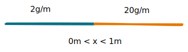

# 📝Definition
There are several concepts related to centroid.

In #mathematics  and #physics, the centroid of a 2-dimensional planar [[lamina]] or a 3-dimensional solid figure is the 
[[mean|arithmetic mean]] position of all the points in the [[surface]] of the figure. The same definition extends to any object in $n$-dimensional Euclidean space.

In #geometry, one often assumes ***uniform mass density***, in which case the [[Barycentric Coordinates|barycenter]] or center of mass coincides with the centroid. Informally, it can be understood as the point at which a cutout of the shape (with uniformly distributed mass) could be perfectly balanced on the tip of a pin.

In #physics, if variations in gravity are considered, then a center of gravity can be defined as the **weighted** mean of all points weighted by their specific weight.

> [!tips] Tips
> To conclude, the difference between centroid in #mathematics and #physics is that.
> - math: the density is uniformly distributed.
> - physic: the density might not be uniformly distributed.

# 🏷(Sub)Categories
What are the sub objects of this subject?
## 1-dimensional center of mass
#### 📝Definition
For a 1-dimensional rod of length $L$ with linear density function $\lambda (x)$ (measured in mass per unit length), the center of mass is the weighted average:
$$
x_c = \frac{\int _0^L x \lambda (x)\, dx}{\int _0^L \lambda (x)\, dx}.
$$
#### 🗃Example
📌center of mass
- 💬Question:
	- How long is $x$ should be when there is a tipping point in balance?
	- 
- ✏Solution:
	- The density is with linear mass density:
		- $$\lambda(x)=\begin{cases}2g/m&\quad0\leq x\leq\frac{1}{2}\\20g/m&\quad\frac{1}{2}\leq x<1\end{cases}$$
	- Given the formula of the 1-d centroid
		- $$x_c = \frac{\int _0^L x \lambda (x)\, dx}{\int _0^L \lambda (x)\, dx}.$$
	- the unit can be
		- $$x_c = \frac{\int _0^L \overbrace{x}^{m} \overbrace{\lambda (x)}^{g/m}\, \overbrace{dx}^{m}}{\int _0^L \underbrace{\lambda (x)}_{g/m}\, \underbrace{dx}_{m}}=m$$
	- We have
		- $$x_c = \frac{\int _0^{1/2} x\cdot 2\cdot dx+ \int _{1/2}^{1}x\cdot20\cdot dx}{\int _0^{1/2} 2\cdot dx+ \int _{1/2}^{1}20\cdot dx}=\frac{31}{44}$$

## 2-dimensional centor of mass
### 📝Definition
For a 2-dimensional region whose mass is proportional to area, the center of mass, or centroid $(\bar{x}, \bar{y})$, is the weighted [[average]] of the position with respect to the area. The $x$- and $y$- coordinates of the centroid are computed by the following integrals:
$$\begin{align}\bar{x}&= \frac{\int _a^b x \, dA}{\int _a^b dA}\qquad dA = y\, dx\\\bar{y}&= \frac{\int _a^b y dA}{\int _a^b dA}\qquad dA = x\, dy\end{align}$$
### 🗃Example
📌Center of mass 2
- 💬Question:
	- Compute the center of mass $(\bar{x}, \bar{y})$ of the unit semi circle centered at the origin, $x^2+y^2 \leq 1$ and $y\geq 0$, with uniform density.
- 🏹Strategy:
	- Rather than calculating the $dA$, we can instantly find out the result of a semi circle is $\frac{\pi}{2}$.
- ✏Solution:
	- Calculate $dA$ in terms of both $x$ and $y$
		- $$\begin{align}x^2+y^2&=1\\x&=\pm\sqrt{1-y^2}\\y&=\pm\sqrt{1-x^2}\end{align}$$
	- Therefore we have
		- $$\bar{x}=\frac{\int _{-1}^1 x \sqrt{1-x^2} \,  dx}{\pi /2} = 0 \quad (\textrm{numerator is an odd function})$$
	- To find $\bar{y}$, the numerator of the weighted average is computed as follows:
		- $$\begin{align}\bar{y}&=\displaystyle \frac{2\int _{0}^1 y \sqrt{1-y^2}\, dy}{\pi /2} \quad (u=1-y^2, \ \ du = -2y\, dy)\\&=\displaystyle \frac{4}{\pi } \int _1^0 -\frac{\sqrt{u}}{2}\, du\\&=\displaystyle \frac{4}{\pi } \int _1^0 -\frac{\sqrt{u}}{2}\, du\\&=\displaystyle \frac{4}{\pi } \left.(1/3)u^{3/2}\right|_0^1 = 4/(3\pi )\end{align}$$

