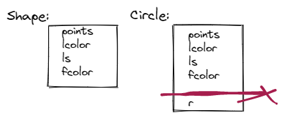

# 📝Definition
- A class is a user-defined type. It is composed of built-in types, other userdefined types, and functions.
- Class is the root word of the term classification. When you design a class, you <u>systematically arrange information and behavior</u> into a meaningful entity.

# 🎯Intent
The class serves as the key to [[Object-oriented Programming Paradigm]]
- [[Encapsulation]]
- [[Inheritance]]
- [[Polymorphism]]

# 🧠Intuition
Find an intuitive way of explanation of this concept.

# 🔎Implementation
 The code or technical stuffs implement this.
## Separation in behavior and implementation
### 📝Definition
The class in C++ is usually separated into:
- A [[header file]] file that provides a declaration of the operation supported by the class
- A [[source file]] that contains the implementation of those operations
### 🚀Benefit / Pros
In Eric Roberts' view, the benefit is that
-   Simplicity
-   Flexibility
-   Security


# ⛈Characteristics / Properties
## 📌Immutable
### 📝Definition
The name is the essence of this topic.
A #cpp  class whose internal state can't be modified after initialization. It's kind of like `readonly` in #csharp .
### ⌚History
Before talking about it, I want to introduce you that in history many programmers insist that instance member should not be modified one initialized since it is private. Such class are said to be **immutable**. The following `Point` class is a good example.
> [!NOTE] Note
> However, this is just one of opinion. You are free to choose the strategies.

```cpp
// immutable class
class Point
{
public:
    Point() :x{0}, y{0}
    {};

    Point(int xc, int yc) :x{xc}, y{yc}
    {};

    int getX() { return x; }
    int getY() { return y; }
private:
    int x; int y;

};
```


# 🌓Complement
- What is the complement of this subject? e.g. vector-covector, constructor-destructor
- 📌**difference between class and [[object]]**
    - class - the <u>definition</u> of a type, e.g. the cookie cutter
    - object - an <u>instance</u> of that type, e.g. the cookie
    
# 💫Operation


# 🧪Composition
## #cpp 
In C++, the parts used to define the class are called members.
- [[data member]]
- function member
> [!faq] What should I do about member?
> Access members by [[Member access operator]]
> Access data members by [[getter and setter]]
- [[Constructor]]
- [[Destructor]].
> [!NOTE] Note
> Constructor and destructor are the most important subject in #cpp according to #BjarneStroustrup . They play an important role in [[RAII]].


## #csharp 
Different from C++, everything in C# are with `class`. Therefore, the composition of a `class` in C# are:
- [[data member|field(csharp)]]
- property
- functions
- event


# 🕳Pitfalls
Be aware of the pitfalls when using this stuffs... (especially considering edge cases)

# 🧬Related Elements
 The closest pattern to current one, what are their differences?
- 📌a chapter demonstrating the the evolution when designing a class in C++
    - In Programming Principles and Practice Using C++ by Bjarne, 9.4.Evolving a Class p308~p318, is really really great.
    - The evolution is
        - starting from making a programing using [[struct]], explaining the pros and cons of it
        - illustrate how member functions are involved to achieve the goal of encapsulation
        - demonstrate how [[Constructor]] helps creating a valid object
        
# 🥼Expert's Advice


# 🥘C++ Class Design Recipe
- Graphics
    - Base Class
        - Code
          ``` c++
          /* deals with color and style and holds sequence of lines */
          class Shape
          {
          public:
              void draw() const;     // deal with color and draw lines
              virtual void move(int dx, int dy);        // move the shape +=dx and +=dy
            
              void set_color(Color col);
              Color color() const;
            
              void set_style(Line_style sty);          
              Line_style style() const;
            
              void set_fill_color(Color col);          
              Color fill_color() const;
            
              Point point(int i) const;     // read-only access to points
              int number_of_points() const;
            
            	/* No copy ctor and copy operator */
              Shape(const Shape&) = delete;
              Shape& operator=(const Shape&) = delete;
            
              virtual ~Shape() { }
          protected:
              Shape() { }
              Shape(initializer_list<Point> lst);    // add() the Points to this Shape
              virtual void draw_lines() const;      // draw the appropriate lines
              void add(Point p);         // add p to points
              void set_point(int i, Point p);     // points[i]=p;
          private:
              vector<Point> points;        // not used by all shapes
              Color lcolor {fl_color()};      // color for lines and characters (with default)
              Line_style ls {0};
              Color fcolor {Color::invisible};     // fill color
          };
          ```
        - Discussion in Details
            - abstract class
                - ``` c++
                  protected:
                      Shape() { }
                      Shape(initializer_list<Point> lst);    // add() the Points to this Shape
                  ```
                - The [[Constructor]] are `protected` which has 2 meaning
                    - The constructor `Shape` itself is NOT `public`. And therefore it can't be initialized in the client code. So the `protected` keyword here is to ensure that we don't make `Shape` objects directly.
                      ``` c++
                      Shape s; //❌ERROR!!
                      ```
                    - The `Shape` is designed to be a [[Base Class]]. Because `protected` can be derived although can't be used directly in the client code.
                    
                - The [[Destructor]] is `virtual`.
                
            - Access Control
                - ``` c++
                  private:
                      vector<Point> points;        // not used by all shapes
                      Color lcolor {fl_color()};      // color for lines and characters (with default)
                      Line_style ls {0};
                      Color fcolor {Color::invisible};     // fill color
                  ```
                - All the [[data member|data members]] are `private`. Their initialization prefers a [[{} - initialization syntax]] style. For `points`, we don't explicitly initialize it since the [[default constructor]] of `vector` provides an empty element list.
                - Based on the preceding reason, we therefore provide a trial of access functions which are similar to the `get/set` function.
                  
                  ``` c++
                  void set_color(Color col);
                  Color color() const;
                  void set_style(Line_style sty);          
                  Line_style style() const;
                  
                  //...
                  ```
                - We have 3 choices of `add()` function and there is a reason behind our choices.
                    - `private` - ❌only `Shape` can add points which is too bad.
                    - `public` - ❌everybody can add points... also bad.
                    - `protected` - ✅ensure that derived classes take control over how points are added since they have various semantics.
                        - `Circle` and `Rectangle` do not allowed add points in `add()` since it is redundant.
                        - `Lines` allows only a pair of points.
                        - `Open_polyline` and `Marks` allow any number of points to be added.
                        
            - Drawing Shapes
                - The draw mechanism of the `Shape` and its derived class based on 2 functions.
                    - ``` c++
                      public:
                      	void draw() const;
                      protected:
                      	virtual void draw_lines() const;
                      ```
                    - `draw` - this is a `public` function called by clients.
                    - `draw_lines` - this is a, so to speak, "wrapper" function which did the actual render work. I personally think a better name should be "render".
                    
                - That's why the `draw` is implemented like so:
                  
                  ``` c++
                  void Shape::draw() const	//👈public to client
                  {
                    Fl_Color oldc = fl_color();          // there is no good portable way of retrieving the current style
                    fl_color(lcolor.as_int());     // set color
                    fl_line_style(ls.style(),ls.width());      // set style
                    draw_lines();				//👈this will delegate different derived class overrided version
                    fl_color(oldc);      // reset color (to previous)
                    fl_line_style(0);    // reset line style to default
                  }
                  ```
                - Smart design isn't it? The Display Engine needn't know what is intent to display but rather invoke the `draw()`.
                  {:height 400, :width 400}
                
            - Copying and Mutability
                - We noticed
                  
                  ``` c++
                  //delete copy constructor and copy assignment operator
                  Shape(const Shape&) =delete;
                  Shape& operator=(const Shape&) =delete;
                  ```
                - In Scott book...?Or others' book. When you design a class that is meant to be a [[Base Class]] in a hierarchy, disable its [[Copy Constructor]] and [[Copy Assignment Operator]] using `=delete`.
                - The benefit is to eliminate the default copy operation across different derived objects. For the following code
                  
                  ``` c++
                  void my_fct(Open_polyline& op, const Circle& c)
                  {
                    Open_polyline op2 = op;     // error: Shape’s copy constructor is deleted
                    vector<Shape> v;
                    v.push_back(c);        	  // error: Shape’s copy constructor is deleted
                    // . . .
                    op = op2;     			  // error: Shape’s assignment is deleted
                  }
                  ```
                  
                  It will be very dangerous that `v.push_back(c)` succeed... But.. We cannot copy a Circle into a Shape-size element “slot” in v; a Circle has a radius but Shape does  not, so `sizeof(Shape)<sizeof(Circle)`. If that `v.push_back(c)` were allowed, the Circle would be “sliced” and any future use of the resulting Shape element would most likely lead to a crash.
                - The memory of a `Shape` and `Circle` are different and if we allow that "copy" operation, some elements will be sliced off.
                  {:height 300, :width 300}
                  We can also prove that with `sizeof(Shape) < sizeof(Circle)`
                