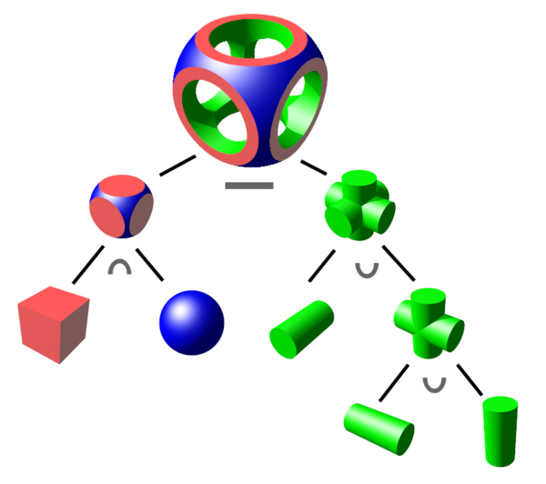
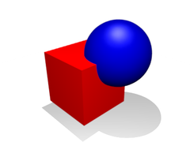
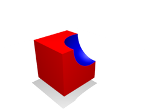
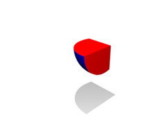

# 📝Definition
Constructive solid geometry is a technique used in solid modeling. Constructive solid geometry allows a modeler to create a complex surface or object by **using Boolean operators to combine simpler objects**, potentially generating visually complex objects by combining a few primitive ones.

# 🧠Intuition
CSG objects can be represented by [[binary tree]]s, where **leaves** represent **primitives**, and **nodes** represent **operations**!

In this figure, the nodes are labeled $\cap$ for intersection, $\cup$ for union, and $-$ for difference.

# 🧪Composition
The simplest solid objects used for the representation are called **geometric primitives**. Typically they are the objects of simple shape:
- [[cuboid]]s
- [[cylinder]]s
- [[prism]]s
- [[pyramid]]s
- [[sphere]]s
- [[cone]]s

> [!info] Info
> The set of allowable primitives is limited by each software package. Some software packages allow CSG on curved objects while other packages do not.

# 💫Operation
Typically there are several operations.

| Union | Difference | Intersection |
| ----- | ---------- | ------------ |
|       |            |              |

## 🌠Union
Merger of two objects into one

## 🔮Difference
Subtraction of one object from another

## ☄Intersection
Portion common to both objects

# 🗃Example
Example is the most straightforward way to understand a mathematical concept.

# 🌱Related Elements
The closest pattern to current one, what are their differences?

# 🍂Unorganized