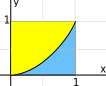
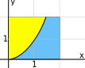

# 📝Definition
A [[continuity|continuous]] distribution is a nonnegative function $w(x)$ that approximates the discrete distribution. The area under a continuous distribution measures the probability that an event occurs.
$$
P(a < x < b) = \frac{\int _a^b w(x)\,  dx}{\int _{-\infty }^{\infty } w(x)\,  dx}
$$
For commonly used distributions, it is common to rescale the function. Since
$$
\int _{-\infty }^{\infty } w(x)\,  dx =C
$$
is a finite constant, we define a new function
$$
p(x) = \frac{w(x)}{C}
$$
This new function $p(x)$ had the property that
$$
\int _{-\infty }^{\infty } p(x)\,  dx =1
$$
> [!NOTE] Note
> The new function is also called [[probability density function]] whose probability in total is 1.

# 🗃Example
📌Uniform distribution
- 💬Question:
	- Question 1: What is the probability that $x^2 < y$ if $(x,y)$ is chosen from the unit square $0 \leq x \leq 1,0 \leq y \leq 1$,  with probability uniformly distributed.
	- Question 2: What is the probability that $x^2 < y$ if $(x,y)$ is chosen from the square of side length 2,  $0 \leq x \leq 2,0 \leq y \leq 2$,  with probability uniformly distributed.
- 🏹Strategy:
	- Recall the formula
	- $$P(a < x < b) = \frac{\int _a^b w(x)\,  dx}{\int _{-\infty }^{\infty } w(x)\,  dx}$$
- ✏Solution:
	- Solution on question 1
		- For unit square, that is easy.
		- 
		- $$\frac{\int _0^1 \left(1-x^2 \right) \,  dx }{\int _0^1 1\,  dx} = \frac{ \left.\phantom{\int } (x - x^3/3) \,  \right|_0^1}{1}= 2/3$$
	- Solution on question 2
		- For square with side length 2, we must be aware the area!! A diagram can help us.
		- 
		- $$\begin{align}\frac{\int _0^{\sqrt{2}} \left( 2-x^2 \right) \,  dx}{\int _0^2 2\,  dx}&=\frac{\left. \left( 2x - x^3/3 \right) \right|_0^{\sqrt{2}}}{4}\\&=\frac{2\sqrt{2}-2\sqrt{2}/3}{4}\\&=\frac{\sqrt{2}}{3}\end{align}$$

