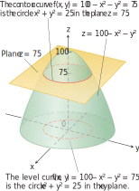

# 📝Definition
The curve in space in which the plane $z = c$ cuts a surface $z = f(x, y)$ is made up of the points that represent the function value $f(x, y) = c$. It is called the contour curve.

# 🧠Intuition
Find an intuitive way of understanding this concept.

# 🌓Complement
[[level curve]]

# 🗃Example
Example is the most straightforward way to understand a mathematical concept.

# 🌱Related Elements
The closest pattern to current one, what are their differences?

# 🍂Unorganized