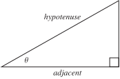
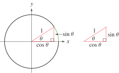
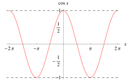

# 📝Definition
$$
\cos\theta=\frac{\text{adjacent}}{\text{hypotenuse}}
$$

# 📈Diagram

# 🧠Intuition
Find an intuitive way of understanding this concept.

# 🗃Example
Example is the most straightforward way to understand a mathematical concept.

# 🌱Related Elements
The closest pattern to current one, what are their differences?

# 🍂Unorganized