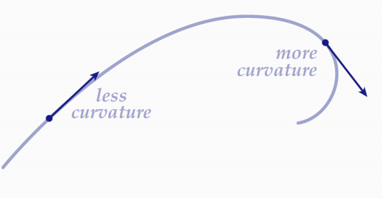

# 📝Definition
The curvature of a [[smooth curve|curve]] is defined to be
$$
\kappa=\left|\frac{d\mathbf{T}}{ds}\right|
$$
the absolute value of the rate of change of $\mathbf{T}$ with respect to $s$, where
- $\mathbf{T}$ is the [[tangent vector|unit tangent vector]]
- $s$ is the [[arc length]]
> [!info] Remark
> We can interpret this equation as "the rate at which $\mathbf{T}$ turns per unit of length along the curve is called the curvature".

___
**Formula for Calculating Curvature**
$$
\begin{align}
\kappa&=\frac{1}{\lVert\mathbf{v} \rVert}\lVert\frac{d\mathbf{T}}{dt}\rVert\\
&=\frac{\lVert\mathbf{T}'(t)\rVert}{\lVert\mathbf{r}'(t)\rVert}
\end{align}
$$

___

**Formula for computation**
Suppose the smooth curve is represented in a [[position vector|radius vector]] $\mathbf{r}(t)$, then the curvature can be computed as
$$
\kappa=\frac{\lVert\dot{\mathbf{r}}\times\ddot{\mathbf{r}}\rVert}{\lVert \dot{\mathbf{r}}\rVert^3}
$$
where the dots is [[Newton’s dot notation]].

> [!info] Remark
> This formula is purely for computation without understanding each component in geometric sense.

# 🧠Intuition
Curvature = "how much a curve *bends*". If the curve is a [[function]], then curvature is second [[derivative]]. (indicate how the curve will bend along the tangent direction)

# 📈Diagram

# 🗃Example

![[torsion#^8902d2]]

- 📁curvature example
	- 💬Question: Show that the curvature of a circle of radius $a$ is $1/a$.
	- ✏Solution:
		- Suppose we have a circle with parameterization
			- $\mathbf{r}(t) = a\cos t\mathbf{i} + a\sin t\mathbf{j}$
		- Recall the formula and go through what we need.
			- $$\kappa=\frac{\lVert\mathbf{T}'(t)\rVert}{\lVert\mathbf{r}'(t)\rVert}$$
		- Found $\mathbf{T}(t)$
			- Recall what is the formula of unit tangent vector
				- $$\begin{align}\mathbf{T}(t)&=\frac{\mathbf{r}'(t)}{\lVert\mathbf{r}'(t)\rVert}=\frac{\mathbf{v}(t)}{\lVert\mathbf{v}(t)\rVert}\end{align}$$
			- Find the 1st derivative
				- $\mathbf{v}(t)=-a\sin t\mathbf{i} + a\cos t\mathbf{j}$
			- Find the magnitude of the 1st derivative
				- $\lVert \mathbf{v}(t)\rVert = \sqrt{(-a\sin t)^2+(a\cos t)^2}=\sqrt{a^2}=|a|=a$    (since $a$ is the radius which has to be $>0$)
			- Therefore
				- $$\begin{align}\mathbf{T}(t)&=\frac{\mathbf{r}'(t)}{\lVert\mathbf{r}'(t)\rVert}=\frac{\mathbf{v}(t)}{\lVert\mathbf{v}(t)\rVert}=\frac{-a\sin t\mathbf{i} + a\cos t\mathbf{j}}{a}=-\sin t\mathbf{i} + \cos t\mathbf{j}\end{align}$$
		- Found $\mathbf{T}'(t)$
			- $$\begin{align}\mathbf{T}'(t)=-\cos t\mathbf{i}  -\sin t\mathbf{j}\end{align}$$
		- Found $\lVert\mathbf{T}'(t)\rVert$
			- $\lVert\mathbf{T}'(t)\rVert=\sqrt{(-\cos t)^2+(-\sin t)^2}=1$
		- Find $\lVert\mathbf{r}'(t)\rVert$
			- Since $\lVert\mathbf{r}'(t)\rVert=\lVert\mathbf{v}(t)\rVert$, therefore $\lVert\mathbf{r}'(t)\rVert=a$
		- Wrap up everything.
			- $$\kappa=\frac{\lVert\mathbf{T}'(t)\rVert}{\lVert\mathbf{r}'(t)\rVert}=\frac{1}{a}$$

# 🌱Related Elements
The closest pattern to current one, what are their differences?

# 🍂Unorganized
In general, there are two important types of curvature: extrinsic curvature and intrinsic curvature.
[[Carl Friedrich Gauss#Gaussian Curvature|Gaussian Curvature]]
