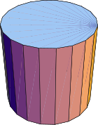
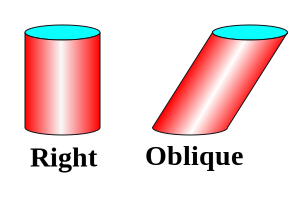

# 📝Definition
The term "cylinder" has a number of related meanings.

**📑Definition in geometry**
- In #SolidGeometry  , the word "cylinder" refers to a solid bounded by a closed [[cylindrical surface|generalized cylinder]] and two parallel [[plane]]s. A cylinder of this sort having a polygonal base is therefore a [[prism]].
- In general #geometry sense, the term "cylinder" is commonly used not only to refer to the solid bounded by a cylindrical surface, but to the cylindrical surface **itself**.

> [!info] Remark
> For this branch. see [[cylindrical surface|generalized cylinder]].

**📃Definition in topology**
In #topology  , a cylindrical surface is not even a true surface, but rather a so-called surface with boundary.

**📄most common definition**
When used without qualification, the term "cylinder" generally refers to the particular case of a **right circular cylinder**.
 

> [!info] Remark
> A cylinder is called a **right** cylinder if it is "straight" in the sense that its cross sections lie directly on top of each other; otherwise, the cylinder is said to be **oblique**. 

# 🧠Intuition
Find an intuitive way of understanding this concept.

# 🗃Example
Example is the most straightforward way to understand a mathematical concept.

# 🌱Related Elements
The closest pattern to current one, what are their differences?

# 🍂Unorganized

# ✒Notation
- Volume
  $$
  \begin{align}
  V=\pi r^2h
  \end{align}
  $$
- Total Surface Area:
  $$
  \begin{align}
  T&=2\pi r h+2(\pi r^2)\\
  &=2\pi r(r+h)
  \end{align}
  $$
    - Lateral surface area:
      $$
      S=2\pi r h
      $$
    - Caps of top and bottom:
      $$
      2(\pi r^2)
      $$
    