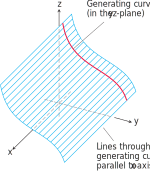
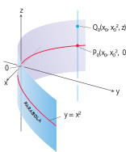

https://mathworld.wolfram.com/GeneralizedCylinder.html
# 📝Definition
A cylinder is a [[surface]] that is generated by moving a straight [[line]] along a given planar curve while holding the line parallel to a given fixed line. The curve is called a **generating curve** for the cylinder.

> [!info] Remark
> In #SolidGeometry  , where [[cylinder]] means *circular* cylinder, the generating curves are [[circle]]s, but now we allow generating curves of any kind.

# 🧠Intuition
Find an intuitive way of understanding this concept.

# 🗃Example
- 📁cylindrical surface example 1
	- 💬Question: Find an equation for the cylinder made by the lines parallel to the $z$-axis that pass through the parabola $y = x^2, z = 0$
	- 🏹Strategy: Understand the impact of $z$.
	- ✏Solution:
		- Suppose the point $P_0(x_0, x_0^2, 0)$ lies on the parabola $y = x^2$ in the $xy$-plane.
		- Then we can infer that for **any value** of $z$, the point $Q(x_0, x_0^2, z)$ lies on the cylinder.
		- Why? Because we can ignore $z$ any way! And it lies on the line $x = x_0, y = x_0^2$ through $P_0$ parallel to the $z$-axis.
		- 
	- 📜Note: Regardless of the value of $z$, therefore, the points on the surface are the points whose coordinates satisfy the equation $y = x^2$. This makes $y = x^2$ an equation for the cylinder. **Because of this, we call the cylinder “the cylinder $y = x^2$ .”**
# 🌱Related Elements
The closest pattern to current one, what are their differences?

# 🍂Unorganized