# 📝Definition
- A **data structure** is **a way to store a non-constant amount of data**, supporting a set of operations to interact with that data.

# 🎯Intent
The data structures determine **how to store data highly affect the runtime** of such a algorithm.
- Many data structures might support the same [[interface]], but could provide different performance for each operation.
- Many problems can be solved trivially by storing data in an appropriate choice of data structure.

# 🧠Intuition
Find an intuitive way of explanation of this concept.

# 🚀Benefit
 A scenario that illustrates the benefit this object provides.

# ⌨Sample Code
 Code fragments

# 🌓Complement
What is the complement of this subject? e.g. vector-covector, constructor-destructor.
- 📌Comparison between Data Structure and [[interface]] ^8a966e5bc270ebf
    - When you think of *data structure* and *interface*, please do combine them altogether!
    - | Data Structure | Interface |
      | ---- | ---- | ---- |
      | A way to store data with algorithms that support operations | A collection of supported operations |
      | a **representation**: **how** operations are supported | a **specification**: **what** operations are supported |
      | the solution! | the problem! |
    - {:height 350, :width 350}
    
# 🧀Applicability
 What are the situations in which this subject can be applied?

# 🧪Composition
What kind of stuffs composite this subject?

# 🏷(Sub)Categories
What are the sub objects of this subject?

# 🔎Implementation
 The code or technical stuffs implement this.

# 🕳Pitfalls
Be aware of the pitfalls when using this stuffs... (especially considering edge cases)

# 🌱Related Elements
 The closest element to current one, what are their differences?

# 📋Prerequisite
Some techniques and objects only work under certain condition.

# 🐍Algorithm
Algorithm relates to this stuff..

# 🥼Expert's Advice
See what experts addressed.

# 🧱Structure
Any other hierarchical issues?
