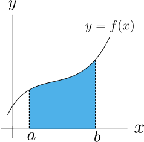
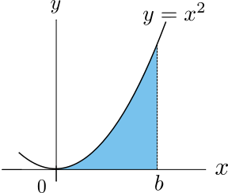
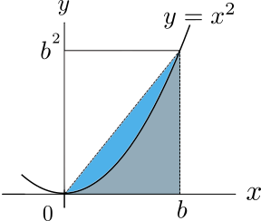
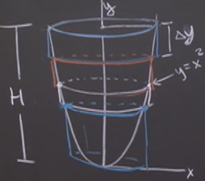
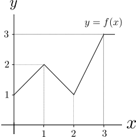
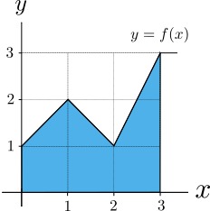

- # 📝Definition
	- Geometric definition
		- The definite integral of $f$ from $a$ to $b$, denoted by
			- $$
			  \int_{a}^{b}f(x)dx
			  $$
		- is the area of the region above the $x$-axis, below the curve $y=f(x)$, and in between the two vertical lines $x=a$ and $x=b$, as shown shaded in the figure below.
			- {:height 200, :width 200}
- # 🧪Composition
	- Limit
		- Lower limit of the integral
			- the $x$-value $a$
		- Upper limit of the integral
			- the $x$-value $b$
		- > ==**Note⚠**==: This is a different sense of the word “[[Limit]]" from when we take the limit of a function.
	- Integrand
		- The middle part is called integrand.
	- Summary
		- $$
		  \underbrace{\int_{a}^{b}}_\text{limit}\underbrace{f(x)-g(x)}_\text{integrand}dx
		  $$
- # 🌓Complement
	- ## 📌 [[Indefinite Integral]] vs. Definite Integral
	  id:: 1de28d3e-6db2-4bb3-b8fa-36e73d2b03d6
		- |                         | Definite Integral      | Indefinite Integral                                          |
		  | ----------------------- | ---------------------- | ------------------------------------------------------------ |
		  | Start Point & End Point | Well-defined Points    | No Points                                                    |
		  | Symbol(same)            | $\int$                 | $\int$                                                       |
		  | Definition(different)   | the area under a curve | the operation that reverses differentiation, the antiderivative |
		  | Compute Method          | Riemann Sum            |                                                              |
		- ⭐That's where [[First Fundamental Theorem of Calculus]] comes in. It gives a precise connection between the two versions of the integral. It tells us we don't need to evaluate limits of Riemann sums in definite integral, instead we only need to find antiderivatives.
- # ⛈Properties
	- Sums
		- $$
		  \int _{a}^{b}\left( f(x) +g(x) \right) \, dx \, =\,  \int _{a}^{b} f(x)\, dx +\int _{a}^{b} g(x) \, dx
		  $$
	- Constant Multiples
		- $$
		  \int _{a}^{b} c \, f(x) \, dx \, =\,  c\, \int _{a}^{b} f(x)\, dx\qquad \text{for any constant}\, c
		  $$
	- Same Upper and Lower Limits
		- $$
		  \int _{a}^{a} \, f(x) \, dx\, =\, 0
		  $$
	- Reversing Limits of Integrals
		- $$
		  \int _{b}^{a} \, f(x) \, dx\, =\, - \int _{a}^{b} \, f(x) \, dx\qquad \text{for any}\,  a,b
		  $$
		- This is the definition of a definite integral with its lower limit greater than its upper limit. It is defined this way to be consistent with FTC1.
	- Combining integrals
		- $$
		  \int _{a}^{c} \, f(x) \, dx\, =\, \int _{a}^{b} \, f(x) \, dx\, +\, \int _{b}^{c} \, f(x) \, dx\qquad \text{for any}\,  a,b,c
		  $$
- # 💫Operation
	- ## Estimation
	  id:: f49a6abe-8012-4bc1-a696-0e74ef00193e
		- 📝Definition
			- If $\, f(x)\leq g(x)$, and $a\leq b$ then
				- $$
				  \displaystyle \int _{a}^{b} f(x)\,  dx\, \,  \, \leq \, \, \,  \int _{a}^{b} g(x)\,  dx \qquad (\text{for}\, \,  a\leq b).
				  $$
			- Notice that the order of $a$ and $b$ matters for this inequality. If instead of $a\leq b$ we have $a\geq b$, then
				- $$
				  \displaystyle \int _{a}^{b} f(x)\,  dx\,  \geq \,  \int _{a}^{b} g(x)\,  dx \qquad (b\leq a).
				  $$
		- 🧠Intuition
			- In other words, if the [[Limit]]s of the integrals are reversed, the inequality is also reversed.
		- 🗃Example
			- ...
		- 🕹Quiz
			- see [quiz using FTC1 to estimate](((6354b797-41f4-4d45-8242-1a3afc9ffe5f))) and [here](((6354b797-c5f3-4485-8f55-fac785d08e7c))).
	- ## Substitution
	  id:: 63515633-d602-43fc-b68f-acf7f289a196
		- 📝Definition
			- If
				- $$
				  \displaystyle \int _{a}^{b} f(x)\,  dx = \int _{a}^{b} g(u(x)) u'(x) \, dx,
				  $$
			- and $u'$ **does not change sign** between $a$ and $b$, then
				- $$
				  \displaystyle \int _{a}^{b} f(x)\,  dx = \int _{a}^{b} g(u(x)) u'(x) \, dx = \int _{u(a)}^{u(b)} g(u) \, du.
				  $$
		- 🧠Intuition
			- The limits of the integral over $u$ are the values of $u$ corresponding to the limits of the integral over $x$.
		- 🕹Quiz
			- ((6354b672-58db-4900-bbb9-f5f49570f9a1))
- # 🕳Pitfalls
	- 📌Caution on substitution
	  id:: 6340c9be-72a7-4416-aa3f-38db07a094ea
		- 📝Definition or Description
			- When we use the method of substitution, we need to be very careful about when $u'$ (or $du$) changes sign. If $u'$ changes sign within the integration interval $[a,b]$, the method of substitution may give the wrong answer. In this case, we need to first rewrite the integral as a sum of two integrals such that within the limits of each integral $u'$ does not change sign, and then use the method of substitution on each integral separately.
		- 🗃Example
			- see [example demonstrating pitfall of substituition](((6354b796-d3ec-46d9-9d35-8cd4fa27ae06))).
- 🤳Applicability
	- {{embed ((a5fcf259-ffec-4b24-813b-1cc5b2537033))}}
- # 🗃Example
	- 📌example demonstrating [the estimation and inequality](((f49a6abe-8012-4bc1-a696-0e74ef00193e)))
		- Prerequisite
			- Given the following factorization.
			- $$
			  \begin{align}
			  x^{n+1}-1&=-(1-x)\left(1+x+x^2+\cdots +x^{n-1}+x^n\right)\\
			  &=-(1-x)\, \left(1+ \sum _{k=1}^{n} x^k\right)
			  \end{align}
			  $$
		- Question
			- Question 1
			  collapsed:: true
				- Use the above equality to find fractional expression for the sum below.
				- $$
				  \displaystyle \frac{1}{1-x}- \left(1+ \sum _{k=1}^{n} x^k\right)\, =\, ?
				  $$
			- Question 2
			  collapsed:: true
				- For any $0\leq x\leq 1$ and any integer $n\geq0$, what is the inequality for the following?
				  collapsed:: true
					- $$
					  \displaystyle \frac{1}{1-x}\, \,\quad\quad (=,\neq,\geq,\leq)?\quad\quad \, \, 1+ \sum _{k=1}^{n} x^k
					  $$
			- Question 3
			  collapsed:: true
				- Integrate the inequality of $\frac{1}{1-x} from $x=0$ to $x=b$ to get an inequality of the logarithmic function.
				  For any $0\leq b<1$ and any integer $n\geq0$, what is the inequality?
				- $$
				  \displaystyle \ln (1-b)\quad\quad (=,\neq,\geq,\leq)? \quad\quad ???
				  $$
		- Solution
			- Solution 1 on Question 1
				- In light of the prerequisite, we have
					- $$
					  \frac{1}{1-x}- \left(1+\sum _{k=1}^{n} x^k\right)\,=\displaystyle \frac{x^{n+1}}{1-x}
					  $$
			- Solution 2 on Question 2
				- With the result from solution1, then we evaluate the right hand side
					- For $0\leq x<1$
						- $x^{n+1}\geq0$
						- $1-x>0$
					- It means
						- $$
						  \displaystyle \frac{x^{n+1}}{1-x}\geq 0
						  $$
				- It means the inequality
					- $$
					  \displaystyle  \frac{1}{1-x}\displaystyle \geq1+\sum _{k=1}^{n} x^k \qquad \text{for}\, \, 0\leq x<1\quad\text{for }0\leq x<1
					  $$
					- Note that this inequality is not strict because when $x=0$,
						- $$
						  \frac{1}{1-x}=1=\displaystyle 1+ \sum _{k=1}^{n} x^k \qquad (x=0)
						  $$
			- Solution 3 on Question 3
				- With the result from solution 2, we can integrate the algebraic inequality from $x=0$ to $x=b$, where $0\leq b<1$, we get
					- $$
					  \begin{align}
					  \int _{0}^{b}\frac{1}{1-x}\, dx &\geq\int _{0}^{b} \left(1+\sum _{k=1}^{n} x^k\right)\, dx\\
					  \left(\ln (1-b)\right) &\geq b+\sum _{k=2}^{n+1} \frac{b^k}{k}=\sum _{k=1}^{n+1} \frac{b^k}{k}\\
					  -\left(\ln (1-b)\right) &\leq -\, \sum _{k=1}^{n+1} \frac{b^k}{k}
					  \end{align}
					  $$
					-
				-
	- 📌example demonstrating [the pitfall of substitution](((6340c9be-72a7-4416-aa3f-38db07a094ea)))
	  id:: 6354b796-d3ec-46d9-9d35-8cd4fa27ae06
		- Question: use substitution to calculate
			- $$
			  \displaystyle \int _{-1}^{1} x^2\, dx
			  $$
		- 🙉Using substitution ==incorrectly==
			- ✏Solution
				- Let $u=x^2$, and we have
				  collapsed:: true
					- $$
					  \begin{align}
					  u&=x^2\\
					  du&=2xdx\\
					  \end{align}
					  $$
				- We can use $u$ to express $x$
					- $$
					  x=\sqrt{u}
					  $$
				- The lower and upper limit would be
				  collapsed:: true
					- lower limit
					  collapsed:: true
						- $$
						  \begin{align}
						  x&=-1\\
						  \sqrt{u}&=-1\\
						  u&=1
						  \end{align}
						  $$
					- upper limit
					  collapsed:: true
						- $$
						  \begin{align}
						  x&=1\\
						  \sqrt{u}&=1\\
						  u&=1
						  \end{align}
						  $$
				- Then we can rewrite equation like so
				  collapsed:: true
					- $$
					  \int _{-1}^{1} x^2 \, dx = \int _{u=(-1)^2}^{u=1^2} u \cdot \frac{du}{2\sqrt{u}} = \int _{1}^{1} u \cdot \frac{du}{2\sqrt{u}}=0
					  $$
			- 🧾Result
				- This is clearly incorrect.❌
			- 🤔Analysis
				- The key mistake is in the step where $x$ changes sign and $x=\pm\sqrt{u}$ rather than $x=\sqrt{u}$!!
		- 🐵Using substitution ==correctly==
			- 🏹Strategy
				- To use the substitution $u=x^2$ correctly, we need to first break the integral into two pieces so that $u'$ does not change sign within the limits of each of the two integral. Since $u'$ changes sign at $0$, **we will break the integral into two** at $0$.
			- ✏Solution
				- Break the inverval
					- $$
					  \displaystyle  \displaystyle \int _{-1}^{1} x^2 \, dx=\displaystyle  \int _{-1}^{0} x^2 \, dx + \int _{0}^{1} x^2 \, dx.
					  $$
				- Then, since $x^2$ is even, we have
					- $$
					  \displaystyle \int _{-1}^{1} x^2 \, dx =2 \int _{0}^{1} x^2 \, dx
					  $$
				- Since $u'$ does not change sign within $[0,1]$, we can use the method of substitution.
					- $$
					  \left.\int _{0}^{1} x^2 \, dx = \int _{(0)^2}^{1^2} u \cdot \frac{du}{2\sqrt{u}} = \frac{1}{2}\left(\frac{2}{3}u^{\frac{3}{2}}\right) \right|_{0}^{1}= \frac{1}{3}
					  $$
			- 🧾Result
				- This gives the correct answer.
				- $$
				  \displaystyle \int _{-1}^{1} x^2 \, dx =\frac{2}{3}
				  $$
	- 📌Estimating the integral
		- Giving the following graph
			- {:height 200, :width 200}
		- Question
			- By only looking at the graph of $y=x^2$, decide which of the following are greater than $\displaystyle \int _0^b \,  x^2 \,  dx\,$ for every $b>0$? (Check all that apply.)
		- Answer
			- $0$
			- $3$
			- $b^3$✅
			- $b^3/2$✅
		- Solution
			- Draw a graph
				- {:height 200, :width 200}
			- Identify the geometries
				- Area of shaded region under parabola (this is the ==definite integral==) $\int _0^b \,  x^2 \,  dx$
				- Area of shaded triangle $\frac{1}{2}b\cdot b^2=\frac{b^3}{2}$
				- Area of rectangle $b\cdot b^2=b^3$
			- Identify the inequalities
				- Area of shaded region under parabola < Area of shaded triangle < Area of rectangle
			- Therefore we have that results.
	- 📌example using definite integral and Riemann sum to solve volume
		- 💬Question: Find the volume of the [[paraboloid]]
			- {:height 200, :width 200}
		- 🏹Strategy: understand the what is the height, what is the radius. And then use Riemann sum. Then integral.
		- ✏Solution:
			- At height $y$, the radius is
				- $$
				  \begin{align}
				  y&=x^2\\
				  x&=\text{radius}=\sqrt{y}
				  \end{align}
				  $$
			- The volume of a small piece is
				- $$
				  \begin{align}
				  \text{Volume}=\pi r^2h=\pi y\Delta y
				  \end{align}
				  $$
			- Sum all the small piece
				- $$
				  \lim_{n\to\infty}\sum_{i}^{n}\pi_{i}\Delta y=\int_0^H\pi ydy
				  $$
	- 📌Definite integral of Piecewise linear functions
		- Given the graph of $y=f(x)$ below.
			- {:height 200, :width 200}
		- By inspection, the shaded region covers $5$ unit squares
			- $$
			  \displaystyle \int _0^3 \,  f(x)\,  dx=5
			  $$
		- Result
			- {:height 200, :width 200}
- 🕹Quiz
	- 📌Quiz on substitution
	  id:: 6354b672-58db-4900-bbb9-f5f49570f9a1
		- 📌Quiz
			- 💬Question: Use the method of [substitution](((63515633-d602-43fc-b68f-acf7f289a196))) to evaluate the following integral.
				- $$
				  \int _{-\sqrt{1/2}}^{\sqrt{1/2}} \frac{dx}{\sqrt{1-x^2}}\, =\,?
				  $$
			- ✏Solution:
				- Using $x=\sin (u), \  dx=\cos (u)\,  du$,
				- $$
				  \int _{-\sqrt{1/2}}^{\sqrt{1/2}}\frac{dx}{\sqrt{1-x^2}} = \int _{-\pi /4}^{\pi /4}\frac{\cos u}{|\cos u|}\, du
				  $$
				- Since $\cos (u)>0$ for $-\pi /4 < x < \pi /4$, we can replace the absolute value of $|\cos (u)|$ by $\cos (u)$ to evaluate the integral.⭐
				- $$
				  \left.\int _{-\pi /4}^{\pi /4}\frac{\cos u}{\cos u}\, du = u\, \right|_{-\pi /4}^{\pi /4}=\frac{\pi }{2}.
				  $$
		- 📌Quiz
			- 💬Question: Use the method of [substitution](((63515633-d602-43fc-b68f-acf7f289a196))) to evaluate the following integral.
				- $$
				  \int _{1}^{e} \frac{\sqrt{\ln x}}{x}\, \, dx \, = \,?
				  $$
			- ✏Solution:
				- Using $u\  =\  \ln x , \  du\  =\  \frac{dx}{x}$,
				- $$
				  \begin{align}
				  \int _{1}^{e} \frac{\sqrt{\ln x}}{x}\,  dx&=\int _{0}^{1}\sqrt{u}\,  du\\
				  &=\left.\phantom{\int } \frac2{3}u^{\frac{3}{2}}\right|_{0}^{1}\  =\  \frac2{3}\  .
				  \end{align}
				  $$
		- 📌Quiz
			- 💬Question: suppose the following
				- $$
				  F(x) = \int _0^x \cos (t^2)\,  dt\quad G(x) = \int _0^x \cos \left(\frac{\pi }{2}u^2\right)\,  du
				  $$
				- $c_1=? c_2=?$
			- ✏Solution:
				- For
					- $$
					  G(x)= \int _0^x \cos \left(\frac{\pi }{2} u^2 \right)\,  du
					  $$
				- Let $t = \sqrt{\frac{\pi }{2}} u, dt = \sqrt{\frac{\pi }{2}} \,  du,\, \,$ then
					- $$
					  \begin{align}
					  G(x)&= \int _0^x \cos \left(\frac{\pi }{2} u^2 \right) \,  du\\
					  &=\sqrt{\frac{2}{\pi }} \, \int _0^{\sqrt{\frac{\pi }{2}}x} \cos t^2 \, dt\\
					  &= \sqrt{\frac{2}{\pi }}\, F\left( \sqrt{\frac{\pi }{2}} x \right)
					  \end{align}
					  $$
				- Therefore, $c_1 = \sqrt{\frac{2}{\pi }},\, \, \text{and }c_2 = \sqrt{\frac{\pi }{2}}$