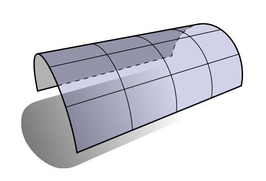

# 📝Definition
Surfaces with zero [[Carl Friedrich Gauss#Gaussian Curvature|Gaussian curvature]] are called _developable surfaces_ because they can be “_**developed**_” or flattened out into the plane without any stretching or tearing.
e.g. 你可以把一张A4纸卷成一个圆柱体
# 📈Diagram

