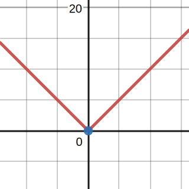

alias:: differentiability

- # 🍴Quick Digest -> Differentiable
	- ## 📝Definition
	  A real function is said to be differentiable at a point if its [[derivative]] exists at that point. The notion of differentiability can also be extended to complex functions (leading to the Cauchy-Riemann equations and the theory of holomorphic functions), although a few additional subtleties arise in complex differentiability that are not present in the real case.
	- ## 🧠Intuition
	  Exist a derivative at that point.
	- ## 🧬Related Elements
		- 📌Relationship: Differentiable vs. [[Continuous]]
			- The following is true.
				- ✅function is differentiable at $x=a$, and therefore 👉 function is continuous at $x=a$
			- The following is wrong.
				- ❌function is continuous at $x=a$, and therefore 👉 function is differentiable at $x=a$
			- Graph
				- Look at the function $f(x)=|x|$
					- at $x=0$ continuous ✅
					- at $x=0$ differentiable ❌
				- {:height 300, :width 300}
		- {{embed ((6322bf32-04a2-4be3-b166-6e9d1600a8e9))}}
	- ## 🧮Expression
	  $$
	  \begin{align}
	  f(x)&=
	  \end{align}
	  $$
	- ## 📈Diagram
	  {:height 300, :width 300}
	- ## ✒Descriptive Explanation
	  A narrative... a descriptive words subject on the concept... 描述性解释…
	- ## 🌓Complement
	  What is the complement of this subject? e.g. vector-covector, constructor-destructor
	- ## 📏Proof 
	  To prove something...
	- ## 🗃Example
	  Example is the most straightforward way to understand a mathematical concept.
	- ## 🤳Applicability
	   What are the situations in which this subject can be applied?
	- ## 🧪Composition
	  What kind of stuffs composite this subject?
	- ## 🏷(Sub)Categories
	  What are the sub objects of this subject?
	- ## ⚖Laws
	  The laws related to this math concepts.
	- ## 🎯Intent
	   A short description what does this thing do?