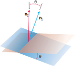

https://mathworld.wolfram.com/DihedralAngle.html
# 📝Definition
The dihedral angle is the angle $\theta$ between two [[plane]]s. 

More precisely, the [[angle between vectors|angle]] between two intersecting [[plane]]s is defined to be the **[[acute angle]]** between their [[normal vector]]s.

# 🧠Intuition
Find an intuitive way of understanding this concept.

# 🗃Example
- 📁dihedral angle example 1
	- 💬Question: Find the angle between the planes $3x - 6y - 2z = 15$ and $2x + y - 2z = 5$.
	- ✏Solution: 
		- The normals are
			- $\mathbf{n}_1 = 3\mathbf{i} - 6\mathbf{j} - 2\mathbf{k}$,
			- $\mathbf{n}_2 = 2\mathbf{i} +1\mathbf{j} - 2\mathbf{k}$.
		- The angle between them is
			- $$\begin{align}\theta&=\cos^{-1}\left(\frac{\mathbf{n}_1\cdot\mathbf{n}_2}{\lVert\mathbf{n}_1\rVert\cdot\lVert\mathbf{n}_2\rVert}\right)\\&=\cos^{-1}\frac{4}{21}\\&\approx1.38\text{ radian}\end{align}$$

# 🌱Related Elements
The closest pattern to current one, what are their differences?

# 🍂Unorganized