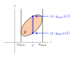

# 📝Definition
**Definition**
The double integral of a function $f(x,y)$ over a region $R$ is the volume under the graph $z=f(x,y)$ above the region $R$ (the region $R$ is a subset of the $xy$-plane).
$$
\iint _{R} f(x,y) \mathop{d A}= \text{Volume under graph $z=f(x,y)$ above $R$}
$$
> [!tip] Volume Under Surface
> <iframe width="500" src="https://courses.edx.org/asset-v1:MITx+18.02.2x+2T2022+type@asset+block/threejs_u6_VolumeUnderSurface.html"></iframe>

___
**Rigorous definition**
$$
\textbf{(Rigorous Definition)} \quad \iint _{R} f(x,y) \mathop{d A}= \lim _{n \to \infty } \sum _{i=1}^{n} f(x_i, y_i) \text{Area}(A_i)
$$
where $A_1, \dots , A_n$ are obtained by cutting $R$ into $n$ non-overlapping pieces whose areas go to zero as $n\to\infty$, and each $(x_i,y_i)$ is a point in $A_i$.
> [!tip] Block Under Surface
> <iframe width="500" src="https://courses.edx.org/asset-v1:MITx+18.02.2x+2T2022+type@asset+block/threejs_u6_ParallelepipedUnderSurface.html"></iframe>
> 
> The slices to a block is an anlogy to [[Riemann sums]].

___
However, in practice, we don't compute the volume like this.Instead we can count the volume "*one slice at a time*". 

For a given value of $x$, let $S(x)$ be the 2-dimensional area of a cross-section of the surface $z=f(x,y)$ along a plane parallel to the $yz$-plane and going through $x$. Then we can say
$$
\iint _{R} f(x,y) \mathop{d A}= \int _{A}^{B} S(x) \mathop{d x},
$$
The endpoints $A$ and $B$ will depend on the region $R$.

> [!tip] Volume by Slicing
> <iframe width="500" src="https://courses.edx.org/asset-v1:MITx+18.02.2x+2T2022+type@asset+block/threejs_u6_VolumeSliceSlider.html"></iframe>

In particular, $A$ and $B$ must be chosen such that the interval $[A,B]$ contains exactly the $x$-coordinates of the points in $R$.
$$
\begin{align}
A&=x_{\text{min}}\\B&=x_{\text{max}}
\end{align}
$$
Assuming we have found $A$ and $B$, the only remaining unknown is the function $S(x)$. This area can be computed by finding the area under the curve that describes the slice. In other words,
$$
S(x) = \int _{C}^{D} f(x,y) \mathop{d y},
$$
where the $C$ and $D$ must be chosen such that the interval $[C,D]$ contains exactly the $y$-coordinates of the points in $R$ for the given slice at $x$.
$$
\begin{align}
C&=y_{\text{min}}\\D&=y_{\text{max}}
\end{align}
$$
Note that $C$ and $D$ will likely be functions of $x$, since at different $x$-values the region will contain wider or narrower $y$-intervals.
Figuring out the endpoints $A,B,C,D$ can be challenging when the region $R$ is complicated. Finding these endpoints is often a large part of the solution to a double integral problem.

Takeaway
We have shown that, rather than using the definition, we can compute a double integral as
$$
\iint _{R} f(x,y) \mathop{d A}= \int _{x_{\min }}^{x_{\max }} \int _{y_{\min }(x)}^{y_{\max }(x)} f(x,y) \mathop{d y}\mathop{d x}.
$$

The right-hand-side is called an **iterated integral**.

Figure 
The figure below demonstrates the meaning of $x_{\min }, x_{\max }, y_{\min }(x), y_{\max }(x)$.

When finding the endpoints for the region $R$, we can think of $x_\min$ and $x_\max$ as the leftmost and rightmost $x$-coordinates of $R$. Next, to figure out $y_\min$ and $y_\max$, we imagine a random value of $x$, and draw a corresponding vertical line through $R$. The values of $y_\min$ and $y_\max$ are defined by the points where this vertical line enters and exits the region $R$.

> [!note]
> In the description above, we referred to $A,B,C,D$ as “endpoints". It is also common to refer to them as the “limits" or “bounds" of integration. These three terms are synonymous, in the context of integrals.

# 🧠Intuition
Find an intuitive way of understanding this concept.

# 🗃Example
- 📁double integral example 1
	- 💬Question: xxx
	- 🏹Strategy: xxx
	- 🗣Answer: xxx
	- ✏Solution: xxx

# 🌱Related Elements
The closest pattern to current one, what are their differences?

# 🍂Unorganized