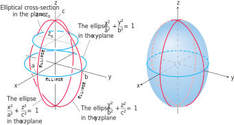

# 📝Definition
The ellipsoid is a [[quadric surface]] given by
$$
{x^2 \over a^2} + {y^2 \over b^2} + {z^2 \over c^2} = 1 .
$$
It cuts the coordinate axes at
- $(\pm a, 0, 0)$     $x$-bound
- $(0, \pm b, 0)$     $y$-bound
- $(0, 0, \pm c)$     $z$-bound
It lies within the [[bounding box|rectangular box]] defined by the inequalities $|x|\leq a, |y|\leq b, |z|\leq c$. 

> [!info] Remark
> It’s called an ellipsoid because all of its "traces"/"generating curve" are [[ellipse|ellipses]].

# 🧠Intuition
Find an intuitive way of understanding this concept.

# 🗃Example
Example is the most straightforward way to understand a mathematical concept.

# 🌱Related Elements
The closest pattern to current one, what are their differences?

# 🍂Unorganized