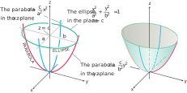

# 📝Definition
Elliptical paraboloid is
$$
{x^2 \over a^2} + {y^2 \over b^2} = {z \over c} \,
$$

# 🧠Intuition
Find an intuitive way of understanding this concept.

# 🗃Example
Example is the most straightforward way to understand a mathematical concept.

# 🌱Related Elements
The closest pattern to current one, what are their differences?

# 🍂Unorganized