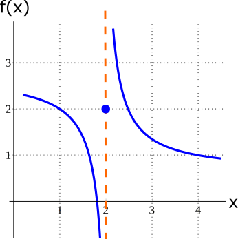
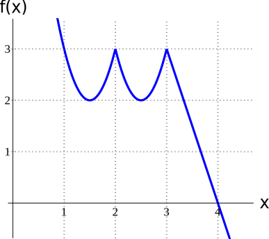
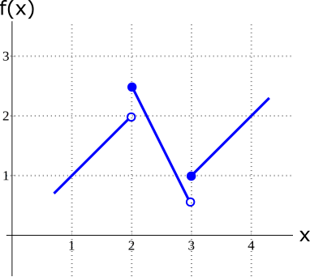

- # 🍴Quick Digest -> Extremum
	- ## 📝Definition
	  An extremum is a [[maximum]] or [[minimum]] .
	- ## 🧪Composition
	   An extremum may be
		- either **local** (a.k.a. a [[relative extremum]]; an extremum in a given region which is not the overall maximum or minimum)
		- or **global**.
	- ## 🧠Intuition
	  extremum in Chinese is 极值.
	- ## 🗃Example
	  Example is the most straightforward way to understand a mathematical concept.
		- 📌Example of not attaining extremes
		  id:: 630a5752-0714-4f64-867c-ff30f8e144bf
			- for the following function $f$ in the interval $[1,4]$
			  {:height 187, :width 182}
			- does $f$ attain the maximum?
				- No.❌
				- Because $f$ gets bigger and bigger **without bound** as $x\to2$ from the right
			- does $f$ attain the minimum?
				- No.❌
				- Because $f$ gets smaller and smaller **without bound** as $x\to2$ from the left
		- 📌Example of attaining extremes
		  id:: 630a5942-6d83-4caf-ba71-5dd608ac07e5
			- for the following
			- for the following function $f$ in the interval $[1,4]$
			  {:height 187, :width 182}
			- does $f$ attain the maximum?
				- Yes.✅
				- at $x=1,2,3$
			- does $f$ attain the minimum?
				- Yes.✅
				- at $x=4$
		- 📌Example of both attaining and not attaining extremes
		  id:: 630a59c6-b1a6-488e-a3e7-6eb2d8653f51
			- for the following
			- for the following function $f$ in the interval $[1,4]$
			  {:height 187, :width 182}
			- does $f$ attain the maximum?
				- Yes.✅
				- at $x=2$
			- does $f$ attain the minimum?
				- No.❌
				- Note that $f(3)=1$, but is not the smallest value of $f$ on $[1,4]$, since $x\to3^+$ and but $f$ never bound to a value
	- ## 🧮Expression
	  $$
	  \begin{align}
	  f(x)&=
	  \end{align}
	  $$
	- ## 📈Diagram
	  
	- ## ✒Descriptive Explanation
	  A narrative... a descriptive words subject on the concept... 描述性解释…
	- ## 🌓Complement
	  What is the complement of this subject? e.g. vector-covector, constructor-destructor
	- ## 📏Proof 
	  To prove something...
	- ## 🤳Applicability
	   What are the situations in which this subject can be applied?
	- ## 🏷(Sub)Categories
	  What are the sub objects of this subject?
	- ## ⚖Laws
	  The laws related to this math concepts.
	- ## 🎯Intent
	   A short description what does this thing do?
	- ## 🙋‍♂️Related Elements
	   The closest pattern to current one, what are their differences?