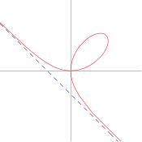
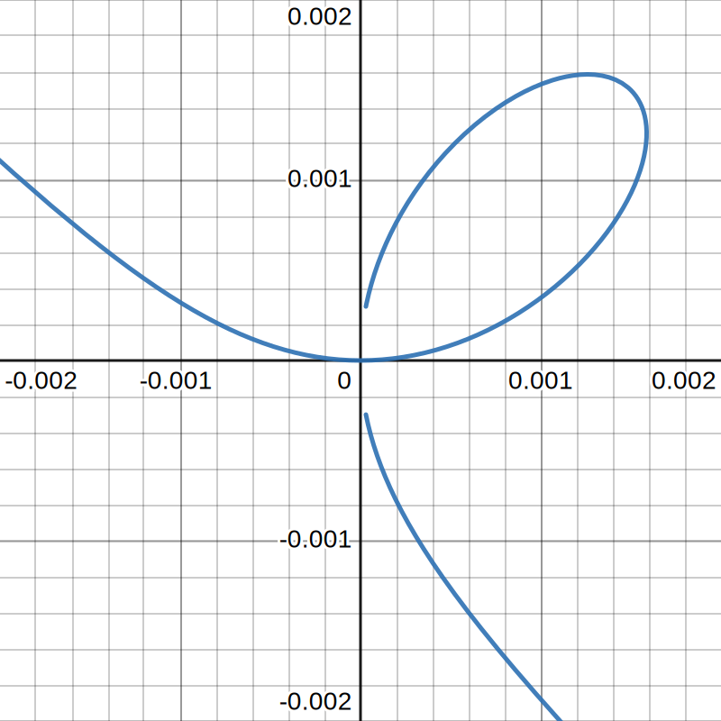

https://mathworld.wolfram.com/FoliumofDescartes.html
# 📝Definition
A [[plane curve]] proposed by Descartes to challenge Fermat's extremum-finding techniques.

In parametric form,
$$
\begin{align}
x&=\frac{3at}{1+t^3}\\
y&=\frac{3at^2}{1+t^3}
\end{align}
$$
In [[Cartesian coordinates]],
$$
\begin{align}
 x^3+y^3=3axy 
\end{align}
$$

The curve has a discontinuity at $t=-1$.
- The left wing is generated as t runs from $-1$ to $0$, the loop as $t$ runs from $0$ to $\infty$.
- The right wing as $t$ runs from $-\infty$ to $-1$.
So if we zoom in the origin to a certain level, we got the following.

# 🧠Intuition
Find an intuitive way of understanding this concept.

# 🗃Example
Example is the most straightforward way to understand a mathematical concept.

# 🌱Related Elements
The closest pattern to current one, what are their differences?

# 🍂Unorganized