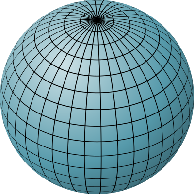
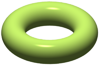
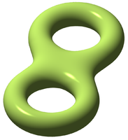

# 📝Definition
**Formal Definition**: A topologically invariant property of a surface defined as the largest number of nonintersecting simple closed curves that can be drawn on the surface without separating it.

# 🧠Intuition
Intuitively, the genus is the number of "holes" of a [[Surface]].

# 🗃Example

**📁genus example 1**

| genus 0 | genus 1 | genus 2 |
| ------- | ------- | ------- |
|    |         |         |

# 🧬Related Elements
The closest pattern to current one, what are their differences?

# 🍂Unorganized