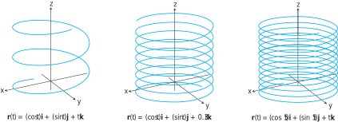

# 📝Definition
The helix is a space curve with parametric equations
$$
\begin{align}
x &= \cos t \\ y &= \sin t \\ z &= t
\end{align}
$$
or written in [[vector-valued function]] format
$$
\mathbf{r}(t)=(\cos t)\mathbf{i}+(\sin t)\mathbf{j}+t\mathbf{k}.
$$

> [!info] Remark
> "Helix" is an old Greek word for "spiral". The curve rises as the $\mathbf{k}$-component $z = t$ increases. Each time $t$ increases by $2\pi$, the curve completes one turn around the [[cylindrical surface|cylinder]].

# 🧠Intuition
Find an intuitive way of understanding this concept.

# 🗃Example
Example is the most straightforward way to understand a mathematical concept.

# 🌱Related Elements
The closest pattern to current one, what are their differences?

# 🍂Unorganized