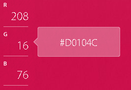

# 📝Definition
The base 16 notational system for representing [[real number|real numbers]]. The digits used to represent numbers using hexadecimal notation are 0, 1, 2, 3, 4, 5, 6, 7, 8, 9, A, B, C, D, E, and F.

> [!warning] Warning
> A number which is written in no matter [[Bit|binary]], [[Decimal|decimal]], or any other base is a property of the representation and not of the number itself.

# 🗃Example
The following table gives the hexadecimal equivalents for decimal numbers from 1 to 30.
| decimal | hexadecimal |      | decimal | hexadecimal |      | decimal | hexadecimal |
| ------- | ----------- | ---- | ------- | ----------- | ---- | ------- | ----------- |
| 1       | 1           |      | 11      | B           |      | 21      | 15          |
| 2       | 2           |      | 12      | C           |      | 22      | 16          |
| 3       | 3           |      | 13      | D           |      | 23      | 17          |
| 4       | 4           |      | 14      | E           |      | 24      | 18          |
| 5       | 5           |      | 15      | F           |      | 25      | 19          |
| 6       | 6           |      | 16      | 10          |      | 26      | 1A          |
| 7       | 7           |      | 17      | 11          |      | 27      | 1B          |
| 8       | 8           |      | 18      | 12          |      | 28      | 1C          |
| 9       | 9           |      | 19      | 13          |      | 29      | 1D          |
| 10      | A           |      | 20      | 14          |      | 30      | 1E          |

# 🎯Intent
The hexadecimal system is particularly important in computer [[Programming]].

# 🚀Benefit / Pros
What makes hexadecimal notation attractive is that you can convert it to [[Bit|binary representation]]. ==4== [[Bit|bits]] can be succinctly expressed using ==1== hexadecimal digit.

# 🤳Applicability
## RGB
==2== hexadecimal digits represent numbers from ==0== to ==255==, a common range used, for example, to specify colors. Thus, in the [[HTML]] language of the web, colors are specified using **3** pairs of hexadecimal digits `RRGGBB`, where `RR` is the amount of $\textcolor{red}{\text{red}}$, `GG` the amount of $\textcolor{green}{\text{green}}$, and `BB` the amount of $\textcolor{blue}{\text{blue}}$. 

# 🏷(Sub)Categories
In hexadecimal, numbers with increasing digits are called [metadromes](https://mathworld.wolfram.com/Metadrome.html), those with nondecreasing digits are called [plaindrones](https://mathworld.wolfram.com/Plaindrome.html), those with nonincreasing digits are called [nialpdromes](https://mathworld.wolfram.com/Nialpdrome.html), and those with decreasing digits are called [katadromes](https://mathworld.wolfram.com/Katadrome.html).