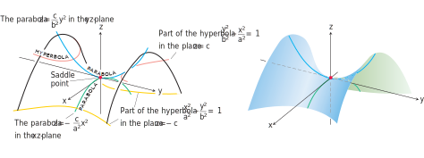

# 📝Definition
A hyperbolic paraboloid is the [[quadric surface]] and doubly ruled surface given by the Cartesian equation
$$
{y^2 \over b^2} - {x^2 \over a^2}= {z \over c},\quad c>0
$$
has symmetry with respect to the planes $x = 0$ and $y = 0$. The cross sections
in these planes are
$$
\begin{align}
x = 0&:\quad \text{the parabola } z = {c\over b^2} y^2\tag{1}\\
y = 0&:\quad \text{the parabola } z = -{c\over a^2} x^2.\tag{2}
\end{align}
$$
In the plane $x = 0$, the parabola opens upward from the origin. The parabola in the plane $y = 0$ opens downward.

If we cut the surface by a plane $z = z_0 > 0$, the cross-section is a [[hyperbola]], 
$$
{y^2 \over b^2} - {x^2 \over a^2}= {z_0 \over c},
$$
with its focal axis parallel to the $y$-axis and its vertices on the parabola in equation (1). If $z_0$ is negative, the focal axis is parallel to the $x$-axis and the vertices lie on the parabola in equation (2).

> [!info] Remark
> Near the origin, the surface is shaped like a saddle or mountain pass. To a person traveling along the surface in the $yz$-plane the origin looks like a minimum. To a person traveling the $xz$-plane the origin looks like a maximum. Such a point is called a [[hyperbolic point|saddle point]] of a surface.

# 🧠Intuition
Find an intuitive way of understanding this concept.

# 🗃Example
Example is the most straightforward way to understand a mathematical concept.

# 🌱Related Elements
The closest pattern to current one, what are their differences?

# 🍂Unorganized