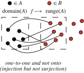

https://mathworld.wolfram.com/Injection.html
# 📝Definition
A function $f$ is one-to-one (or injective) if different elements map to different elements:
$$
x\neq x'\quad\Rightarrow\quad f(x)\neq f(x').
$$
Equivalently, a function is one-to-one if
$$
f(x)\neq f(x')\quad\Rightarrow\quad x\neq x'.
$$

Let $f$ be a [[function]] defined on a [[set]] $A$ and taking values in a set $B$. Then $f$ is said to be an injection if, whenever $f(x)=f(y)$, it must be the case that $x=y$. Equivalently, $x\neq y$ implies $f(x)\neq f(y)$. 

> [!info] Remark
> In other words, $f$ is an injection if it maps distinct objects to distinct objects.

# 🌓Complement
[[surjective function]]

# 🧠Intuition
Find an intuitive way of understanding this concept.

# 🗃Example
Example is the most straightforward way to understand a mathematical concept.

# 🌱Related Elements
The closest pattern to current one, what are their differences?

# 🍂Unorganized