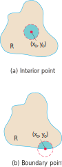

# 📝Definition
A point $(x_0, y_0)$ in a region ([[set]]) $R$ in the $xy$-plane is an interior point of $R$ if it is the center of a disk of positive radius that lies entirely in $R$.

# 🧠Intuition
Find an intuitive way of understanding this concept.

# 🗃Example
Example is the most straightforward way to understand a mathematical concept.

# 🌱Related Elements
The closest pattern to current one, what are their differences?

# 🍂Unorganized