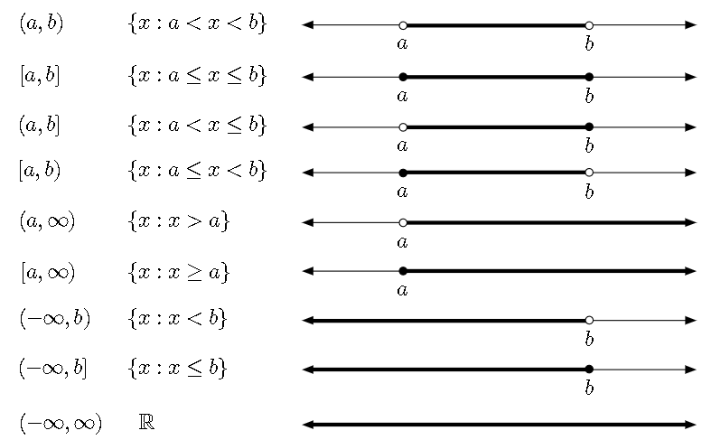

# 📝Definition
The notation of an interval. A function's [[function#^bdaa359665a4eb20|domain]], [[function#^edfd03044fa2551e|range]], and [[function#^c436ffd3332b45e9|codomain]] also use this notation.
# 🗃Example
$$
\{x:2\leq x<5\}
$$
# 🏷Categories
## 🔖Open
$$(a,b)$$
## 🔖Close
$$[a,b]$$
## 🔖Mixed
$$(a,b]$$

# 📈Diagram

