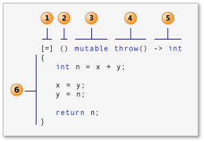

# ⌚History
The lambda expression can be dated back to [[lambda calculus]].
# ✒Terminology
> [!question] 
> Why do we use the terminology **lambda expression**🤔?
> - Greek letter $\lambda$ refers to an **anonymous** function
> - **lambda** - chosen since it is equated with something nameless
> - **expression** - required since the code can be evaluated and will ==return a value==


# CPP
[Lambda expressions in C++ | Microsoft Learn](https://learn.microsoft.com/en-us/cpp/cpp/lambda-expressions-in-cpp?view=msvc-170)
## 🗺Big Picture
Before #cpp11 , a helper function to work with `<algorithm>` is complicate.
```cpp
class Person
{
	public:
	std::string firstname() const;
	std::string lastname() const;
	//...
	friend bool operator< (const Person&, const Person&);  // or op<=> since cpp20
};

bool lessPerson(const Person &p1, const Person &p2)
{
	//sort name
	return p1.lastname() < p2.lastname();
}


//business codes
std::vector<Person> coll;
std::sort(coll.begin(), coll.end(), lessPerson)
```
But with lambda, things look easier.
```cpp
// pass directly as function object
std::sort(coll.begin(), coll.end(), [](const Person &p1, const Person &p2){return p1.lastname() < p2.lastname();});

// or make a function object then reuse again and again
auto isOdd = [] (int i) {return i%2 != 0;};
int num = std::count_if(nums.cbegin(), nums.cend(),  // range
						isOdd);                      // criterion
auto pos = std::find_if(nums.cbegin(), nums.cend(),  // range
						isOdd);                      // criterion
```


## 📝Definition
In #cpp11  and later, a lambda expression—often called a _lambda_—is a convenient way of defining an anonymous function object (a _closure_) right at the location where it's invoked or passed as an argument to a function. 

A more technical definition, lambda expression is an expression which returns a [[Function Object]].


## 🎯Intent
Typically lambdas are used to encapsulate a few lines of code that are passed to algorithms or asynchronous functions.⭐


## 🧠Intuition
Lambda is function defined on the fly.
```c++
std::vector<int> v {4, 1, 3, 5, 2, 3, 1, 7};
int num_geq5 = std::count_if(v.cbegin(), v.cend(), [](int a)
    {
        return (a >= 5);
    });
```


## 🧪Composition

- 1️⃣capture clause (Also known as the lambda-introducer in the C++ specification.)
- 2️⃣parameter list ==Optional==. (Also known as the lambda declarator)
- 3️⃣mutable specification ==Optional==.
- 4️⃣exception-specification ==Optional==.
- 5️⃣trailing-return-type ==Optional==.
- 6️⃣lambda body.


> [!NOTE] Note
> Variables can be only appear in "capture clause" and "parameter list".


### Capture clause
#### 📝Definition
A lambda begins with the capture clause. 
#### 🧠Intuition
Sometimes capture clause is also called "==behavior parameter==". 
> [!warning] Warning
> The *parameter in capture clause* is totally different from *parameter in parameter list*.

#### 🎯Intent
Introduct objects outside of lambda and use them!

#### 🏷(Sub)Categories
Capture clause specifies which variables are captured, and whether the capture is by value or by reference.
- `[ ]`, indicates that the body of the lambda expression accesses no variables in the enclosing scope.
- `[&]` means all variables that you refer to are captured by reference
- `[=]` means they're captured by value.
> [!warning]
> Only variables that are mentioned in the lambda body are captured when a capture-default is used.

#### 🕳Pitfalls / Cons
`[&]` and `[=]` play an important role in [[Asynchronous Programming]].
- Reference captures introduce a lifetime dependency
- Value captures have no lifetime dependencies.

**📌capture is performed when the lambda is created**
```cpp
string prefix = "elem: ";

auto printElem = [prefix] (int i) {
	cout << prefix << i << endl;
} ;

prefix = "value: ";
printElem(13);  //👈the output is "elem: 13"
```
Since `prefix` is captured by value and therefore later modification on `prefix` won't affect the lambda.

**📌be cautious on deleted object by reference**
#TODO an example to demonstrate.

#### ⌨Sample Code
- rules using `&`, `=`  in capture clause  
	-  
	  ``` cpp
	  	  struct S { void f(int i); };
	  	  - void S::f(int i)
	  	  {
	  	  [&, i]{};      // ✅OK
	  	  [&, &i]{};     // ❌ERROR: i preceded by & when & is the default
	  	  [=, this]{};   // ❌ERROR: this when = is the default
	  	  [=, *this]{ }; // ✅OK: captures this by value. See below.
	  	  [i, i]{};      // ❌ERROR: i repeated
	  	  }
	  ```
- equivalent capture clause  
	- suppose there are variable `total` and `factor`,  the following are the same.  
	-  
	  ``` cpp
	  	  [&total, factor]
	  	  [factor, &total]
	  	  [&, factor]
	  	  [=, &total]
	  ```
- introduce and initialize new variables in the capture clause  
	-  
	  ``` cpp
	  	  //c++14 feature
	  	  pNums = make_unique<vector<int>>(nums);
	  	  //...
	  	        auto a = [ptr = move(pNums)]()
	  	          {
	  	             // use ptr
	  	          };
	  ```

**📌capture the clause `const-reference`**
When I was learning the capture clause, I was wondering if there is a way [[pass-by-reference|pass-by-const-reference]]? Actually there is! Use the #cpp17   `std::as_const()` .
```cpp
    vector<string> strs{"ONE", "TWO", "THREE", "FOUR", "FIVE"};
    auto printElem = [&strs = std::as_const(strs)] (int input)
    {
        for(const auto &str : strs)
        {
            cout << str << " " << input << endl;
        }
    };
```

**📌make a temporary object on the captuer clause**
```cpp
auto price = [discount = getDiscount(customer)] (auto item) {
	return getPrice(item) * discount;
}
```


📌 #TODO capture clause withh `unique_ptr`

#### 🧬Related Elements
##### 📌capture clause with [[this keyword|this pointer]]
When you have a lambda inside a class, things get interesting acroos different version of C++.
- #cpp11 
	- `[this]`
	- capture `this` pointer by value
- #cpp14 
	- `[self=*this]`
	- capture `*this` object by value, initialize a new variable
- #cpp17 
	- `[*this]`
	- capture `*this` object by value
- #cpp20
	- `[this]` is deprecated

> [!question] Why `[this]` capture will be deprecated?
> Think about it. The `this` keyword is a [[pointer]] refer to the current object. We are writing a lambda inside a class, therefore we can access all the [[data member]]! So why should we need a `this` pointer in the capture clause?! Hence, the `[this]` syntax in cpp11 is deprecated.

### parameter list

#### 📝Definition
A parameter list (_lambda declarator_ in the Standard syntax) is optional and in most aspects resembles the parameter list for a function.

#### 🧠Intuition
If the parameter list is empty, the lambda expression is jutst like a function accept arguments. Parameter in parameter list is "==call parameters=="

#### ⌨Sample Code
- basic parameter list  
	-  
	  ``` cpp
	  	  auto y = [] (int first, int second)
	  	  {
	  	      return first + second;
	  	  };
	  ```
- generic parameter list  
	-  
	  ``` cpp
	  	  auto y = [] (auto first, auto second)
	  	  {
	  	      return first + second;
	  	  };
	  ```

📌default parameter supported in #cpp14 
```cpp
auto myLamb = [ ] (const std::string &data, uint max = 20)//👈default param
			  { return data.substr(0, max); };
```


### mutable specification

#### 📝Definition
A keyword `mutable` followed after parameter list.

#### 🎯Intent
The **`mutable`** specification enables the body of a lambda expression to modify variables that are captured by value.
> [!NOTE] Note
> Typically, a lambda's [[function call operator]] is const-by-value, but use of the **`mutable`** keyword cancels this out. It doesn't produce mutable data members.

#### 🧠Intuition
Lambda expression is stateless by default. The `mutable` keyword makes them ==stateful==(modification allowed). The state refers to [[Finite Automaton#🧪Composition#state|the state of finite automaton]].

#### ⌨Sample Code
Following is an example of using `mutable`.
```cpp
auto changed = [prev = 0] (auto val) mutable {
	bool changed = (prev != val);
	prev = val;
	return changed;
};

vector<int> numbers{7, 42, 42, 0, 3, 3, 7};
copy_if(numbers.cbegin(), numbers.cend(), ostream_iterator<int>{cout, " "}, changed); cout << endl;
copy_if(numbers.cbegin(), numbers.cend(), ostream_iterator<int>{cout, " "}, changed); cout << endl;
copy_if(numbers.cbegin(), numbers.cend(), ostream_iterator<int>{cout, " "}, changed); cout << endl;
changed(7);
copy_if(numbers.cbegin(), numbers.cend(), ostream_iterator<int>{cout, " "}, changed); cout << endl;

//output:
//7 42 0 3 7 
//7 42 0 3 7
//7 42 0 3 7
//42 0 3 7
```
This is an super interesting code! It sets a "counter" inside the lambda to see if something is modified.

### exception-specification
#### 📝Definition
Use the **`noexcept`** exception specification to indicate that the lambda expression doesn't throw any exceptions.
> [!WARNING] Warning
> As with ordinary functions, the Microsoft C++ compiler generates warning [C4297](https://learn.microsoft.com/en-us/cpp/error-messages/compiler-warnings/compiler-warning-level-1-c4297?view=msvc-170) if a lambda expression declares the **`noexcept`** exception specification and the lambda body throws an exception


#### ⌨Sample Code
- `noexcept` in lambda expression  
	-  
	  ``` cpp
	  	  // compile with: /W4 /EHsc
	  	  int main() // C4297 expected
	  	  {
	  	     []() noexcept { throw 5; }();
	  	  }
	  ```


### trailing-return-type
#### 📝Definition
It is just an explicit way telling the compiler what is the `return` type by using `->`.

#### 🎯Intent
Increase the probability of success in [[Type Deduction]].

#### ⌨Sample Code
- trailing-return-type is optional  
	-  
	  ``` cpp
	  	  std::vector<int> nums{1,2,3,4,5};
	  	  auto isAnyLower3 = std::any_of(nums.cbegin(), nums.cend(),
	  	                     [](int num)
	  	                     {
	  	  					  return i < 5;
	  	                     });
	  ```
	-  
	  ``` cpp
	  	  std::vector<int> nums{1,2,3,4,5};
	  	  auto isAnyLower3 = std::any_of(nums.cbegin(), nums.cend(),
	  	                     [](int num)->bool  //👈trailing return type
	  	                     {
	  	  					  return i < 5;
	  	                     });
	  ```
- trailing-return-type helps type deduction  
	-  
	  ``` cpp
	  	  auto x1 = [](int i){ return i; }; // ✅OK: return type is int
	  	  auto x2 = []{ return{ 1, 2 }; };  // ❌ERROR: return type is void, deducing
	  	                                    // return type from braced-init-list isn't valid
	  	  auto x2 = [] ()->std::initializer<int> { return{ 1, 2 }; }; //✅OK: explicitly state the type
	  ```


### lambda body⭐
#### 📝Definition
The lambda body of a lambda expression is a compound statement. The body of a lambda expression can access these kinds of variables:
-   Captured variables from [[lambda expression#Capture clause|capture clause]].
-   Parameters defined in [[lambda expression#parameter list|parameter list]].
-   Locally declared variables.
-   Class data members, when declared inside a class and **`this`** is captured.
-   Any variable that has static storage duration—for example, global variables.

#### ⌨Sample Code
- interesting lambda expression example  
	-  
	  ``` cpp
	  	  int m = 0;
	  	  int n = 0;
	  	  [&, n] (int a) mutable { m = ++n + a; }(4);
	  	  cout << m << endl << n << endl;
	  ```
	- 1️⃣ `mutable` allows  `n`  to be modified within the lambda.  
	- 2️⃣ `n` is capture by value and therefore in the end is `0` (even though is incremented).  
	- 3️⃣ This is a "`void`" lambda since no `return`. So what is the input?! The `4`!! You can see the chunk `[&, n] (int a) mutable { m = ++n + a; }` as a function...  


## 🏷(Sub)Categories
There is something called constexpr lambda expressions using [[constexpr]].

### `constexpr` lambda expressions
#### 📝Definition
The initialization of each captured or introduced data member is allowed within a constant expression.
> [!INFO] C++ Version
> `constexpr` lambda expression is #cpp17 feature.

#### ⌨Sample Code
- simple example  
	-  
	  ``` cpp
	  	  int y = 32;
	  	  auto answer = [y]() constexpr
	  	      {
	  	          int x = 10;
	  	          return y + x;
	  	      };
	  	  
	  	  constexpr int Increment(int n)
	  	  {
	  	    return [n] { return n + 1; }();
	  	  }
	  ```
- implicitly deduce as `constexpr` if its result satisfies the requirements of a `constexpr` function  
	-  
	  ``` cpp
	  	  auto answer = [](int n)
	  	  {
	  	    return 32 + n;
	  	  };
	  	  
	  	  constexpr int response = answer(10);
	  ```
- complicate example  
	-  
	  ``` cpp
	  	  auto Increment = [](int n)
	  	  {
	  	    return n + 1;
	  	  };
	  	  
	  	  constexpr int(*inc)(int) = Increment;
	  ```
	- If a lambda is implicitly or explicitly ** `constexpr` **, conversion to a function pointer produces a ** `constexpr` ** function  

### Generic lambda expressions
#### 📝Definition
Since #cpp14 , you can define generic lambda with [[auto keyword]] for `auto, const auto&`.
#### ⌨Sample Code
```cpp
    auto twice = [] (const auto &item)
    {
        return item + item;
    };
```


## 🤳Applicability
In the following, I will list out some scenarios that lambda expression is a good fit.

**📌convenient way to define functions at runtime**
Suppose you wanna measure something, but that **metric** might change.
```cpp
// in the old time, not good❌
bool less7(int val)
{
	return val < 7;
}
bool less8(int val)
{
	return val < 8;
}

int amountLessMax(int max)
{
	return std::count_if(nums.cbegin(), nums.cend(),
						 lessMax???)  //what should you do?🤔
}
```
With lambda, you can solve this by [[lambda expression#CPP#🧪Composition#Capture clause|capture clause]]!
```cpp
// with lambda, good✅
int amountLessMax(int max)
{
	return std::count_if(nums.cbegin(), nums.cend(), 
			[max](int val) {return val < max;});    //👈😁
}
```

**📌lambda can be defined locally**
Suppose you want to process the invoice with taxes.
```cpp
void processInvoice(const Invoice &inV)
{
	//...
}
```
You can do this by insert a local function.
```cpp
void processInvoice(const Invoice &inV)
{
	double tax = getTax(inV);
	auto plusTax = [tax] (double d)
						 {
							 return d * (1+tax);
						 };
	std::transform(inV.begin(), inV.end(), plusTax);
}
```
Another is something #thingsIDK 
```cpp
auto makeAddTextFunc(const Invoice &inV)
{
	double tax = getTax(inV);
	return [tax] (double d) //👈interesting, return a lambda!
	{
		d * (1 + tax);
	};
}
```

## 🔎Implementation
This section aims to investigate - 🤔"What is lambda expression exactly"? Let's first address the conclusion:

> [!NOTE] Conclusion
> For each lambda in the source code, the compiler does:
> - define a class ("closure type")
> - create an [[object]] of this class
> 
> For **generic** lambda, the compiler does:
> - define a [[Templates|template]] class
> - create an object of this class


### 📌lambda expression is a wrapper of [[Function Object]]
For the following code
```cpp
// lambda expression
auto add = [] (int x, int y) { return x + y;};
```
the [[Compiler]] will help you generate:
```cpp
// function object generated by compiler
class lambda???
{
public:    
    int operator() (int x, int y) const
    {
        return x + y;
    }
};
```
We can verify this by manually compare a function object and lambda.
```cpp
class lambda32xzj //👈I make this strange name to mimic the compiler's generation
{
public:    
    int operator() (int x, int y) const
    {
        return x + y;
    }
};

int main()
{
    // 1️⃣using lambda expression
    auto add = [] (int x, int y) { return x + y;};
    int i = 13;
    cout << add(i, 3) << endl;
    cout << add.operator()(i, 3) << endl;//👈proof of lambda is a function object

    // 2️⃣using function object
    auto addObject = lambda32xzj{};
    int j = 13;
    cout << addObject(j, 3) << endl;
    cout << addObject.operator()(j, 3) << endl;
    return 0;
}
```


### 📌"capture clause in lambda" is "parameter in function object"
In the preceding, we prove the following are equivalent:
- lambda expression
- function object.

In this section, we will prove the following are equivalent:
- [[lambda expression#CPP#🧪Composition#Capture clause]]
- the [[Glossary#Parameter|parameter]] of the function object.

For the following code
```cpp
auto inRange = [MIN, MAX] (int num)
{
	return (MIN <= num) && (num <= MAX);
};
```
is equivalent to
```cpp
class lambda32xzj
{
private:
    int m_min{0};
    int m_max{0};
public:
    lambda32xzj(int min, int max)  //👈capture clause, behavior parameters
        :m_min{min}, m_max{max}
        {}

    bool operator() (int num) const  //👈call parameters
    {
        return (m_min <= num) && (num <= m_max);
    }
};
```
We can verify this:
```cpp
    constexpr int MIN = 0;
    constexpr int MAX = 10;

    // using lambda expression
    auto inRange = [MIN, MAX] (int num)
    {
        return (MIN <= num) && (num <= MAX);
    };

    // using function object
    auto inRangeObject = lambda32xzj{MIN, MAX};

    // test in range
    vector<int> numbers{1, 32, 6};
    cout << "num in range: " << count_if(numbers.cbegin(), numbers.cend(), inRange) << endl;
    cout << "num in range: " << count_if(numbers.cbegin(), numbers.cend(), inRangeObject) << endl;
```

### 📌Generic lambda is not class to be generic
For the following lambda expression,
```cpp
auto twice_Lambda = [] (const auto &item1, const auto &item2)
{
	return item1 + item2;
};
```
What is its equivalent class design?🤔
```cpp
class lambda32xzj  //👈the class is not template class
{
public:
    template<typename T1, typename T2>  //👈but rather, the function operator is template and generic!✅
    auto operator() (T1 x, T2 y) const
    {
        return x + y;
    }
};
```


### 📌Generic lambda vs. Generic function
> [!important] Conclusion
> Let's make it clear by comparison:
> - the generic lambda is still a function object.
> - the generic lambda $\neq$ the generic function
> - the generic lambda is "generic" by making its [[function call operator]] "generic".

Suppose we have a generic lambda:
```cpp
auto printLmbd = [] (const auto &elems)
{
	for(const auto &elem : elems)
	{
		cout << elem << " ";
	}
	cout << endl;
};
```
And a generic function
```cpp
template<typename T>
void printFunc(const T &elems)
{
    for(const auto &elem : elems)
    {
        cout << elem << " ";
    }
    cout << endl;
}
```
The following code can prove their difference.
```cpp
vector<int> v{1, 2, 3};
//..
printFunc(v);
printLmbd(v);
printFunc<string>("hello");  //✅
printLmbd<string>("hello");  //❌ERROR

call(printFunc, v);  //❌ERROR
call(printFunc<decltype<(v)>, v);  //✅
call(printLmbd, v);  //✅
```
I understand their difference while #thingsIDK that how can I design a function to mimic the `call` function.

### 📌When does the lambda expression "run"?
This is a really great question. The "run" can be divided into 2 parts:
- 1️⃣the declaration of lambda
- 2️⃣the invoke of lambda
When in 1️⃣, the code will run into all the parts except the body. This can be easily understood since lambda expression is a function object and the 1️⃣ is actually the definition of the class.
When in 2️⃣, the code will run into the body. It is also easily to understand since the invoke actually invokes the code in the function call operator.
# CSharp
[Lambda expressions - C# reference | Microsoft Learn](https://learn.microsoft.com/en-us/dotnet/csharp/language-reference/operators/lambda-expressions)


