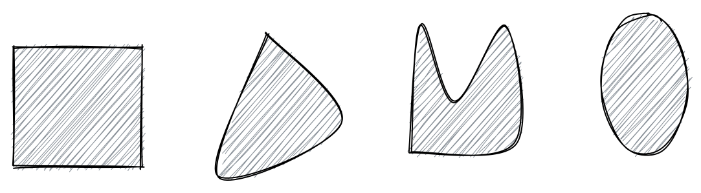

alias:: laminae

- # 🍴Quick Digest -> lamina
	- ## 📝Definition
	  A two-dimensional planar closed surface $L$ which has a mass $M$ and a surface density $\sigma(x,y)$ (in units of mass per areas squared) such that
	  $$
	  M=\int_{L}\sigma(x,y)dxdy. 
	  $$
	- ## 📈Diagram
	  {:height 122, :width 446}
	- ## 🧠Intuition
	  Find an intuitive way of understanding this concept.
	- ## 🧮Expression
	  $$
	  \begin{align}
	  f(x)&=
	  \end{align}
	  $$
	- ## ✒Descriptive Explanation
	  A narrative... a descriptive words subject on the concept... 描述性解释…
	- ## 🌓Complement
	  What is the complement of this subject? e.g. vector-covector, constructor-destructor
	- ## 📏Proof 
	  To prove something...
	- ## 🗃Example
	  Example is the most straightforward way to understand a mathematical concept.
	- ## 🤳Applicability
	   What are the situations in which this subject can be applied?
	- ## 🧪Composition
	  What kind of stuffs composite this subject?
	- ## 🏷(Sub)Categories
	  What are the sub objects of this subject?
	- ## ⚖Laws
	  The laws related to this math concepts.
	- ## 🎯Intent
	   A short description what does this thing do?
	- ## 🙋‍♂️Related Elements
	   The closest pattern to current one, what are their differences?