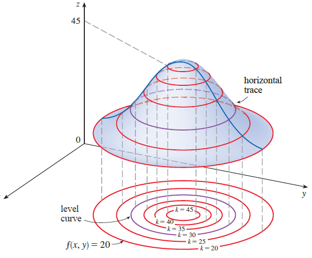
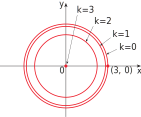

# 📝Definition
**📄Definition**
📃Definition

The set of points in the [[plane]] where a function $f(x, y)$ has a constant value $f(x, y) = c$ is called a level curve of $f$.

> [!info] Remark
> Level curve is about the [[domain]] of a function. That's why we have another definition below.

**📑Definition**
A level curve $f(x, y)=k$ is the set of all points in the [[domain]] of $f$ at which $f$ takes on a given value $k$.
> [!info] Remark
> see the curve on the domain is level curve. The curve actually on the surface is [[contour curve]].
> 

# 🧠Intuition
Find an intuitive way of understanding this concept.

# 🌓Complement
[[contour curve]]

# 🗃Example
- 📁level curve example
	- 💬Question: Sketch the level curves of the function $$g(x,y)=\sqrt{9-x^2-y^2}\quad k=0,1,2,3$$
	- ✏Solution:
		- The level curves are
			- $$g(x,y)=\sqrt{9-x^2-y^2}=k\quad\text{or}\quad x^2+y^2=9-k^2$$
		- This is a family of concentric circles with center $(0,0)$ and radius $\sqrt{9-k^2}$.
		- 

# 🌱Related Elements
The closest pattern to current one, what are their differences?

# 🍂Unorganized