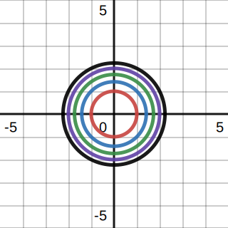
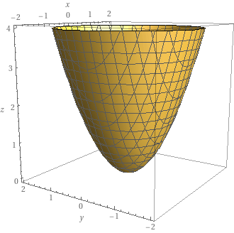

# 📝Definition
The level set of a [[differentiable]] function
$$
f:\mathbb{R}^n\to \mathbb{R}
$$
corresponding to a real value $c$ is the [[set]] of points
$$
\{(x_1,...,x_n)\in\mathbb{R}^n:f(x_1,...,x_n)=c\}
$$

# 🏷Categories
## 🔖[[level curve]]
If $n=2$, the level set is a plane curve known as a level curve.

## 🔖[[level surface]]
If $n=3$, the level set is a [[surface]] known as a level surface.

## 🔖==c-level set==
It merely means the "real value" of the level set refers to the constant called $c$. You can also name "$\textcolor{blue}{k}$-level set" or "$\textcolor{red}{w}$-level set" as long as
$$
\begin{align}
\{(x_1,...,x_n)\in\mathbb{R}^n:f(x_1,...,x_n)=\textcolor{blue}{k}\\
\{(y_1,...,y_n)\in\mathbb{R}^n:f(y_1,...,y_n)=\textcolor{red}{w}
\end{align}
$$

## 🔖==zero-level set==
It merely means the "real value" of the level set is $0$.

# 🧠Intuition
Find an intuitive way of understanding this concept.

# 🗃Example
**📁level set example 1**
Suppose the following
$$
\phi(x,y)=x^2+y^2=c
$$
This is a $\textcolor{red}c$-level set. It is a bunch of circles and they can be drawn as followed.

If a function $f:\mathbb{R}^2\to\mathbb{R}$ then a graph of $(x,y,f(x,y))$ can be represented in 3D. It will form a surface. Therefore, we can put a $z$ value here to visualize.
$$
\textcolor{red}z=\phi(x,y)=x^2+y^2=c
$$

🗂
📂

# 🌱Related Elements
The closest pattern to current one, what are their differences?

# 🍂Unorganized