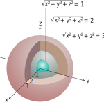
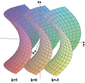

# 📝Definition
The set of points $(x, y, z)$ in space where a function of 3 independent variables has a constant value $f(x, y, z) = c$ is called a level surface of $f$.

# 🧠Intuition
Find an intuitive way of understanding this concept.

# 🗃Example
- 📁level surface example
	- 💬Question: describe the level surfaces of the function $$f(x,y,z)=x^2-y-z^2$$
	- ✏Solution: The level surfaces are $y= x^2-z^2-k$, a family of [[hyperbolic paraboloid]]s.
		- 

# 🌱Related Elements
The closest pattern to current one, what are their differences?

# 🍂Unorganized