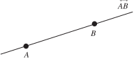
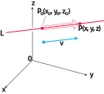

# 📝Definition
A line is a straight one-dimensional figure having no thickness and extending infinitely in both directions.
# 🧠Intuition
Find an intuitive way of understanding this concept.

# ✒Notation
## 🖋General Notation
A line is uniquely determined by two points, and the line passing through points $A$ and $B$ is denoted $\overleftrightarrow{AB}$.

## ✏Vector Equation
A [[vector]] equation for the line $L$ through $P_0(x_0, y_0, z_0)$ parallel to the vector $v$ is
$$
\mathbf{r}(t)=\mathbf{r}_0+t\mathbf{v},\quad-\infty<t<\infty,
$$
where
- $\mathbf{r}$ is the [[position vector]] of a point $P(x,y,z)$ on $L$
-  $\mathbf{r}_0$ is the position vector of point $P_0(x_0, y_0, z_0)$.

## 🖊Parametric Equations
The standard parametrization of the line through $P_0(x_0, y_0, z_0)$ parallel to $\mathbf{v} = v_1\mathbf{i} + v_2\mathbf{j} + v_3\mathbf{k}$ is
$$
x = x_0 + tv_1, y = y_0 + tv_2, z = z_0 + tv_3, -\infty< t <\infty
$$

# 📈Diagram

# 🗃Example
- 📂line parametric equation example 1
	- 💬Question: Find parametric equations for the line through $(-2, 0, 4)$ parallel to $\mathbf{v} = 2\mathbf{i} + 4\mathbf{j} -2\mathbf{k}$.
	- ✏Solution:
		- Figure out $x_0, y_0, z_0$
			- $x_0 = -2$
			- $y_0 = 0$
			- $z_0 = 4$
		- Figure out $v_1, v_2, v_3$
			- $v_1=2$ 
			- $v_2=4$
			- $v_3=-2$
		- Put them together
			- $x = -2 + 2t, y = 4t, z = 4 - 2t .$

# 💫Operation
🌠
🔮
☄
## 🌌Distance from Point to Line
see [[point-line distance]].

## 🥏Intersection between Line and Plane
see [[line-plane intersection]]
🌀

# 🌱Related Elements

# 🍂Unorganized