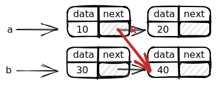
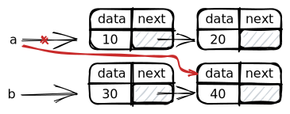
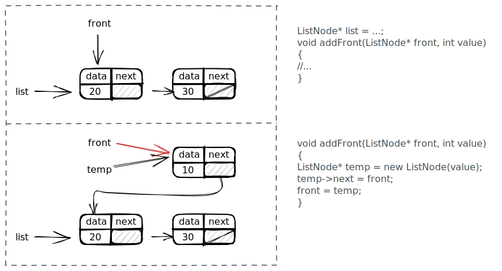
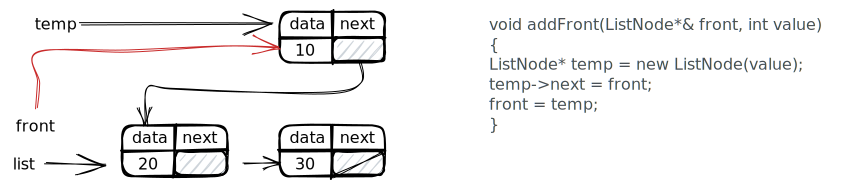

# 📈Diagram
## Understand Linked List from diagrams
Suppose you have a simple linked list like so.
```cpp
struct ListNode
{
	int data;
    ListNode *next;
};
```

**📌Initialization of pointers**
⌨code
```cpp
ListNode *front = new ListNode();
front->data = 42;
front->next = new ListNode();
front->next->data = -3;
front->next->next = new ListNode();
front->next->next->data = 17;
front->next->next->next = new ListNode();
front->next->next->next->data = 9;
front->next->next->next->next = nullptr;
```
📈diagram


**📌Reassigning Pointers**
Suppose you already have the following setup.

What should the following operations look like?
1️⃣
```cpp
a->next = b->next;
```

2️⃣
```cpp
a = b->next;
```

3️⃣
```cpp
a = b;
```

4️⃣
```cpp
a->next->next = b;
```


**📌Wrong `addFront` function**
```cpp
void addFront(ListNode* front, int value)
{
    ListNode* temp = new ListNode(value);
    temp->next = front;
    front = temp;
}

// the client code
int main()
{
    ListNode* list = ...;
    addFront(list, 10);
}
```
The preceding code looks good but actually it is wrong! What it does is the following.


**📌Correct `addFront` function**
It can be easily fixed by [[pass-by-reference]].
```cpp
void addFront(ListNode*& front, int value)
{
    //...
}
```
It looks weird😲 but that is how it is.

