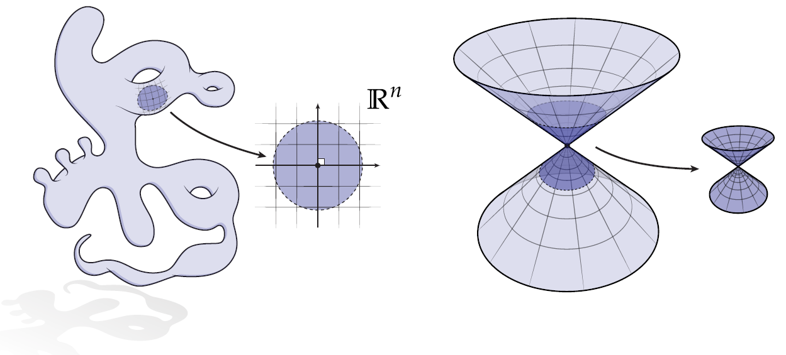
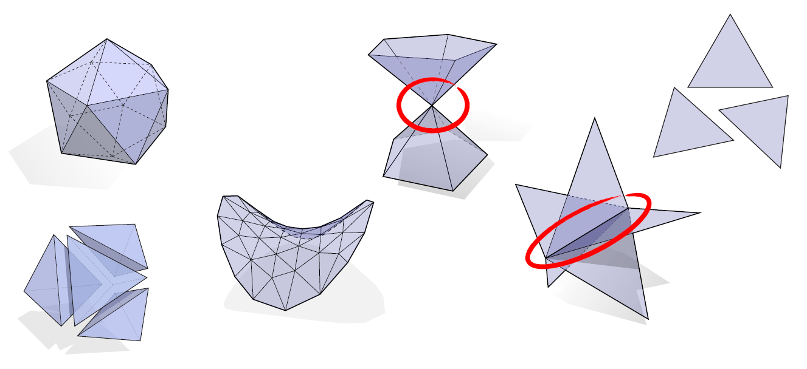
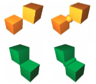
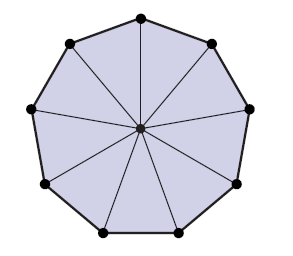
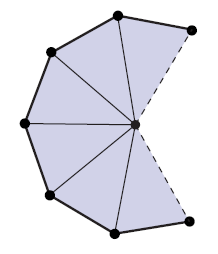

# 📝Definition
A simplicial $k$-complex is ***manifold*** if the [[simplicial complex#💫Operation#☄Link|link]] of every vertex looks like a $(k-1)$-dimensional sphere.

# 🚀Benefit / Pros
 In a nutshell, it is neat ingredient for **datastructure** which is easy to process and comfortable to access its "neighbor".
    
# 🌓Complement
[[nonmanifold]]
    
# 🧠Intuition
- Digest Manifold and Nonmanifold intuitively 
	- 
	  Apparently, the left is manifold for it can be sampled any point with a cartesian $xy$ plane while the right can't. The "funky" and "chaotic" shape is not manifold.
	- 
	  Nonmanifold is marked with red. Others are manifold.
	
- Digest Manifold and Nonmanifold intuitively
	- 
	- The [[manifold]] is the boundary surface of a non-degenerate 3D solid where "*non-degenerate*" means that the solid does not have any infinitely thin parts or features such that the surface properly separates the "interior" and "exterior" of the solid.
	- Top left is with a degenerate/ [[nonmanifold]] vertex, which is fixed in top right.
	- Bottom left is with a degenerate/ [[nonmanifold]] edge, which is fixed in bottom right.
  
# 🏷Categories
## 🔖Manifold Triangle Mesh
> [!info] Remark
> Manifold Triangle Mesh is $k=2$, [[triangle mesh|simplicial 2-complexes]] 

### 👑Importance
Manifold triangle mesh is of enormous importance in geometric processing and modeling.

### 📝Definition
Requirements for a triangle mesh is manifold:

 | simplex            | requirement                                                   | Image                                                  |
 | ------------------ | ------------------------------------------------------------- | ------------------------------------------------------ |
 | edges              | every edge is contained in **exactly** **2** triangles        |               |
 | edges(boundary)    | just **1** along the **boundary**                             |      |
 | vertices           | every vertex is contained in **a single “loop”** of triangles |           |
 | vertices(boundary) | **a single “fan”** along the **boundary**                     |  |

# 🌈Properties
## 🔴Local Manifoldness
### 📝Definition
A [[Continuity|continuous]] parametric surface is locally manifold at a [[surface]] point $p$ if, for every other surface point $q$ within **a sufficiently small** sphere of radius $\delta$ around $p$, the corresponding [[pre-image]] is contained in a circle of some radius $\epsilon=O(\epsilon)$ around the pre-image of $p$.

### 🧠Intuition
A more intuitive way to express this condition is to say that the surface patch that lies within a sufficiently small $\epsilon$-sphere around $p$ is topologically equivalent ([[Homeomorphic]]) to a disk.

> [!info] Remark
> Since this second definition does not require a parameterization, it applies to implicit representations as well.

### 📈Diagram

A great diagram illustrates the idea of "sufficiently small".

## 🟠Complexity on manifold check
- **💬Question**: How hard is it to check if a given simplicial complex is manifold?
- **🗣Answer**: 
	-  ($k=1$) trivial—is it a loop?
	- ($k=2$) trivial—is each link a loop?
	- ($k=3$) is each link a 2-sphere? Just check if $V-E+F = 2$ ( [Euler’s Characteristic](((634e3b2d-a1b3-4803-9236-d18373f2c133)))  )
	- ($k=4$) is each link a 3-sphere? …Well, it’s known to be in NP! [S. Schleimer 2004]

              
            