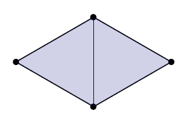
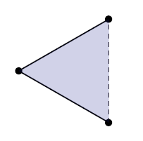

- 📝Definition
	- The name is the essence of this topic.
	- {{embed ((7194425b-b12b-4200-a441-4a5e60af1270))}}
- 🚀Benefit / Pros
	- In a nutshell, it is neat ingredient for **datastructure** which is easy to process and comfortable to access its "neighbor".
- 🌓Complement
	- [[Nonmanifold]]
- 🧠Intuition
	- Digest Manifold and Nonmanifold intuitively
	  id:: 54d8471c-1468-4200-848c-878dd479f50e
		- {:height 200, :width 400}
		  Apparently, the left is manifold for it can be sampled any point with a cartesian $xy$ plane while the right can't. The "funky" and "chaotic" shape is not manifold.
		- {:height 200, :width 400}
		  Nonmanifold is marked with red. Others are manifold.
	-
- 🏷(Sub)Categories
	- Manifold Triangle Mesh ($k=2$, [[simplicial 2-complexes]] )
	  id:: 28012548-e918-478b-8a20-78c5d51e7588
		- 👑Importance
			- Manifold triangle mesh is of enormous importance in geometric processing and modeling.
		- 📝Definition
			- Requirements for a triangle mesh is manifold:
			- | simplex            | requirement                                                  | Image                                                        |
			  | ------------------ | ------------------------------------------------------------ | ------------------------------------------------------------ |
			  | edges              | every edge is contained in **exactly** **2** triangles       | {:height 150, :width 150} |
			  | edges(boundary)    | just **1** along the **boundary**                            | {:height 150, :width 150} |
			  | vertices           | every vertex is contained in **a single “loop”** of triangles | {:height 150, :width 150} |
			  | vertices(boundary) | **a single “fan”** along the **boundary**                    | {:height 150, :width 150} |
- 💫Support Operation
	- Complexity on manifold check
		- Question:
			- How hard is it to check if a given simplicial complex is manifold?
		- Answer
			- ($k=1$) trivial—is it a loop?
			- ($k=2$) trivial—is each link a loop?
			- ($k=3$) is each link a 2-sphere? Just check if $V-E+F = 2$ ( [Euler’s Characteristic](((634e3b2d-a1b3-4803-9236-d18373f2c133)))  )
			- ($k=4$) is each link a 3-sphere? …Well, it’s known to be in NP! [S. Schleimer 2004]