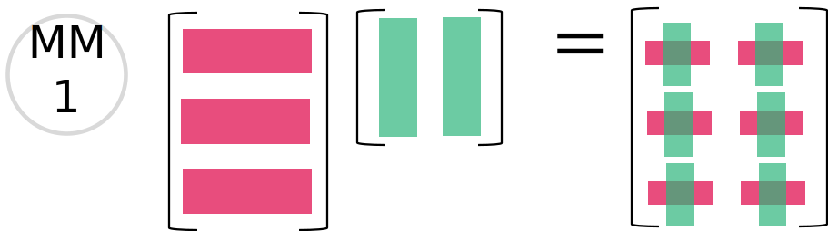
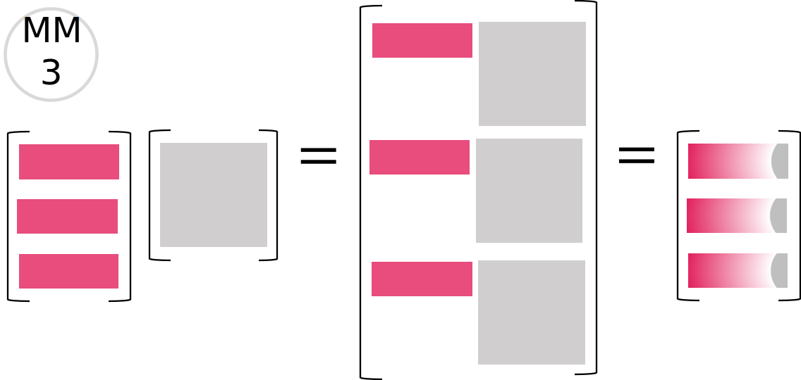

# 📋Prerequisite
If there are matrices $F$($m\times n_1$) and $G(n_2\times p)$, **the prerequisite for a valid matrix multiplication is** that $m_1=m_2$. 
Or you can memorize as $A(m\times n)B(n\times p)$.

# 📝Definition
**📄Definition - row way**
Suppose there 2 matrices $F$($n\times m_1$) and $G(m_2\times p)$, the product is a matrix with shape $n\times p$. The $i,j$ element of the matrix is:
$$
(FG)_{ij} = \sum_{k=1}^{m}F_{ik}G_{kj}
$$
The `2,2` element of output matrix is the dot product of $2$-th row of $F$ and $2$-th colomn of $G$
$$
M_{22}=\begin{bmatrix}3&0&1\end{bmatrix}\begin{bmatrix}2\\0\\2\end{bmatrix}
$$
> [!note]
> The reason why I refer this as "row way" is that, this way of thinking is good for computation. Same analogy of the [[Matrix-Vector Products#🏷Categories#🔖Rows Picture in Matrix-Vector Multiplication|row picture in Matrix-Vector Products]].

___
**📑Definition - column way**
Suppose there are 2 matrices $A$ and $B$, we see the composition of $B$ as the follow
$$\begin{bmatrix}
| & |& |\\
\mathbf{x} & \mathbf{y}& \mathbf{z}\\
| & |& |\\
\end{bmatrix}.$$
Then the multiplication of matrix $A$ and $B$ can be see it as followed.
$$
AB=A
\begin{bmatrix}
| & |& |\\
\mathbf{x} & \mathbf{y}& \mathbf{z}\\
| & |& |\\
\end{bmatrix}
=
\begin{bmatrix}
Ax&Ay&Az
\end{bmatrix}
$$
> [!tip]
> The columns of the result is each column of $B$ goes over the [[Matrix-Vector Products]] with matrix $A$.


# 🧠Intuition
Columns of $AB$ are combinations of columns of $A$.
> [!question]
> #TODO Exaplain why every vector in $C(AB)$ -a.k.a. every combination of the columns of $AB$- is also in the [[column space]] of $A$.


# 🧾 Cheat Sheet
## 📜M-M 1
**📝Description**:
Every element becomes a [[inner product|dot product]] of [[row vector]] and [[column vector]].

**📈Diagram**:


**✒Notation**
$$
\begin{bmatrix}
1&2\\3&4\\5&6
\end{bmatrix}
\begin{bmatrix}
w_1&x_1&y_1&z_1\\w_2&x_2&y_2&z_2
\end{bmatrix}
=
\begin{bmatrix}
(1w_1+2w_2) & (1x_1+2x_2) & (1y_1+2y_2) & (1z_1+2z_2)
\\
(3w_1+4w_2) & (3x_1+4x_2) & (3y_1+4y_2) & (3z_1+4z_2)
\\
(5w_1+6w_2) & (5x_1+6x_2) & (5y_1+6y_2) & (5z_1+6z_2)
\end{bmatrix}
$$

**🗃Example**
$$
\begin{align}
\begin{bmatrix}
4&3\\1&0\\0&5
\end{bmatrix}
\begin{bmatrix}
4&1&0&0\\1&3&2&5
\end{bmatrix}
&=
\begin{bmatrix}
(4\times4+3\times1) & (4\times1+3\times3) & (4\times0+3\times2) & (4\times0+3\times5)
\\
(1\times4+0\times1) & (1\times1+0\times3) & (1\times0+0\times2) & (1\times0+0\times5)
\\
(0\times4+5\times1) & (0\times1+5\times3) & (0\times0+5\times2) & (0\times0+5\times5)
\end{bmatrix}\\
&=
\begin{bmatrix}
19 & 13 & 6 & 15
\\
4 & 1 & 0 & 0
\\
5 & 15 & 10 & 25
\end{bmatrix}
\end{align}
$$


___
## 📜M-M 2
**📝Description**:
$Ax$ and $Ay$  are [[linear combination]]s of columns of $A$.

**📈Diagram**:


**✒Notation**
$$
\begin{align}
\begin{bmatrix}
1&2\\3&4\\5&6
\end{bmatrix}
\begin{bmatrix}
w_1&x_1&y_1&z_1\\w_2&x_2&y_2&z_2
\end{bmatrix}
&=
A
\begin{bmatrix}
\mathbf{w}&\mathbf{x}&\mathbf{y}&\mathbf{z}
\end{bmatrix}
\\
&=
\begin{bmatrix}
A\mathbf{w}&A\mathbf{x}&A\mathbf{y}&A\mathbf{z}
\end{bmatrix}
\\
&=
\begin{bmatrix}
\begin{bmatrix}
1&2\\3&4\\5&6
\end{bmatrix}
\begin{bmatrix}
w_1\\w_2
\end{bmatrix}
&
\begin{bmatrix}
1&2\\3&4\\5&6
\end{bmatrix}
\begin{bmatrix}
x_1\\x_2
\end{bmatrix}
&
\begin{bmatrix}
1&2\\3&4\\5&6
\end{bmatrix}
\begin{bmatrix}
y_1\\y_2
\end{bmatrix}
&
\begin{bmatrix}
1&2\\3&4\\5&6
\end{bmatrix}
\begin{bmatrix}
z_1\\z_2
\end{bmatrix}
\end{bmatrix}
\end{align}
$$

**🗃Example**
$$
\begin{align}
\begin{bmatrix}
4&3\\1&0\\0&5
\end{bmatrix}
\begin{bmatrix}
4&1&0&0\\1&3&2&5
\end{bmatrix}
&=
\begin{bmatrix}
\begin{bmatrix}4&3\\1&0\\0&5\end{bmatrix}\begin{bmatrix}4\\1\end{bmatrix}\quad&
\begin{bmatrix}4&3\\1&0\\0&5\end{bmatrix}\begin{bmatrix}1\\3\end{bmatrix}\quad&
\begin{bmatrix}4&3\\1&0\\0&5\end{bmatrix}\begin{bmatrix}0\\2\end{bmatrix}\quad&
\begin{bmatrix}4&3\\1&0\\0&5\end{bmatrix}\begin{bmatrix}0\\5\end{bmatrix}
\end{bmatrix}\\
&=
\begin{bmatrix}
4\begin{bmatrix}4\\1\\0\end{bmatrix}+1\begin{bmatrix}3\\0\\5\end{bmatrix}\quad&
1\begin{bmatrix}4\\1\\0\end{bmatrix}+3\begin{bmatrix}3\\0\\5\end{bmatrix}\quad&
0\begin{bmatrix}4\\1\\0\end{bmatrix}+2\begin{bmatrix}3\\0\\5\end{bmatrix}\quad&
0\begin{bmatrix}4\\1\\0\end{bmatrix}+5\begin{bmatrix}3\\0\\5\end{bmatrix}
\end{bmatrix}\\
&=
\begin{bmatrix}
\begin{bmatrix}16\\4\\0\end{bmatrix}+\begin{bmatrix}3\\0\\5\end{bmatrix}\quad&
\begin{bmatrix}4\\1\\0\end{bmatrix}+\begin{bmatrix}9\\0\\15\end{bmatrix}\quad&
\begin{bmatrix}0\\0\\0\end{bmatrix}+\begin{bmatrix}6\\0\\10\end{bmatrix}\quad&
\begin{bmatrix}0\\0\\0\end{bmatrix}+\begin{bmatrix}15\\0\\25\end{bmatrix}
\end{bmatrix}\\
&=
\begin{bmatrix}
\begin{bmatrix}19\\4\\5\end{bmatrix}\quad&
\begin{bmatrix}13\\1\\15\end{bmatrix}\quad&
\begin{bmatrix}6\\0\\10\end{bmatrix}\quad&
\begin{bmatrix}15\\0\\25\end{bmatrix}
\end{bmatrix}\\
&=
\begin{bmatrix}
19 & 13 & 6 & 15
\\
4 & 1 & 0 & 0
\\
5 & 15 & 10 & 25
\end{bmatrix}
\end{align}
$$

___
## 📜M-M 3
**📝Description**:
The produced rows are [[linear combination]]s of rows.
**📈Diagram**:


**✒Notation**
$$
\begin{align}
\begin{bmatrix}
1&2\\3&4\\5&6
\end{bmatrix}
\begin{bmatrix}
w_1&x_1&y_1&z_1\\w_2&x_2&y_2&z_2
\end{bmatrix}
&=
\begin{bmatrix}\mathbf{a}^*_1\\\mathbf{a}^*_2\\\mathbf{a}^*_3\end{bmatrix}
B\\
&=
\begin{bmatrix}\mathbf{a}^*_1B\\\mathbf{a}^*_2B\\\mathbf{a}^*_3B\end{bmatrix}
\\
&=
\begin{bmatrix}
\begin{bmatrix}1&2\end{bmatrix}&B\\
\begin{bmatrix}3&4\end{bmatrix}&B\\
\begin{bmatrix}5&6\end{bmatrix}&B
\end{bmatrix}
\end{align}
$$
**🗃Example**
$$
\begin{align}
\begin{bmatrix}
4&3\\1&0\\0&5
\end{bmatrix}
\begin{bmatrix}
4&1&0&0\\1&3&2&5
\end{bmatrix}
&=
\begin{bmatrix}
\begin{bmatrix}4&3\end{bmatrix}\begin{bmatrix}4&1&0&0\\1&3&2&5\end{bmatrix}\\\\
\begin{bmatrix}1&0\end{bmatrix}\begin{bmatrix}4&1&0&0\\1&3&2&5\end{bmatrix}\\\\
\begin{bmatrix}0&5\end{bmatrix}\begin{bmatrix}4&1&0&0\\1&3&2&5\end{bmatrix}
\end{bmatrix}\\\\
&=
\begin{bmatrix}
4\times\begin{bmatrix}4&1&0&0\end{bmatrix}+3\times\begin{bmatrix}1&3&2&5\end{bmatrix}
\\
1\times\begin{bmatrix}4&1&0&0\end{bmatrix}+0\times\begin{bmatrix}1&3&2&5\end{bmatrix}\\
0\times\begin{bmatrix}4&1&0&0\end{bmatrix}+5\times\begin{bmatrix}1&3&2&5\end{bmatrix}
\end{bmatrix}\\\\
&=
\begin{bmatrix}
&\begin{bmatrix}16&4&0&0\end{bmatrix}&+&\begin{bmatrix}3&9&6&15\end{bmatrix}\\
&\begin{bmatrix}4&1&0&0\end{bmatrix}&+&\begin{bmatrix}0&0&0&0\end{bmatrix}\\
&\begin{bmatrix}0&0&0&0\end{bmatrix}&+&\begin{bmatrix}5&15&10&25\end{bmatrix}
\end{bmatrix}\\
&=
\begin{bmatrix}
19 & 13 & 6 & 15
\\
4 & 1 & 0 & 0
\\
5 & 15 & 10 & 25
\end{bmatrix}
\end{align}
$$
> [!info] Remark
> The [[row vector]] here acts like a selectors. For example the $\begin{bmatrix}4&3\end{bmatrix}$ literally says pick me 4row1 from the right hand side and 3row2 from the right hand side.


___
## 📜M-M 4
**📝Description**:
Multiplication $AB$ is broken down to a sum of [[rank one matrix]].

**📈Diagram**:


**✒Notation**
$$
\begin{align}
\begin{bmatrix}
1&2\\3&4\\5&6
\end{bmatrix}
\begin{bmatrix}
w_1&x_1&y_1&z_1\\w_2&x_2&y_2&z_2
\end{bmatrix}
&=
\begin{bmatrix}1\\3\\5\end{bmatrix}
\begin{array}{@{}c@{}}
\begin{bmatrix}w_1&x_1&y_1&z_1\end{bmatrix}\\\mathstrut\\\mathstrut
\end{array}
+
\begin{bmatrix}2\\4\\6\end{bmatrix}
\begin{array}{@{}c@{}}
\begin{bmatrix}w_2&x_2&y_2&z_2\end{bmatrix}\\\mathstrut\\\mathstrut
\end{array}\\
&=
\begin{bmatrix}
1w_1 & 1x_1 & 1y_1 & 1z_1\\
3w_1 & 3x_1 & 3y_1 & 3z_1\\
5w_1 & 5x_1 & 5y_1 & 5z_1
\end{bmatrix}
+
\begin{bmatrix}
2w_1 & 2x_1 & 2y_1 & 2z_1\\
4w_1 & 4x_1 & 4y_1 & 4z_1\\
6w_1 & 6x_1 & 6y_1 & 6z_1
\end{bmatrix}
\end{align}
$$
**🗃Example**
$$
\begin{align}
\begin{bmatrix}
4&3\\1&0\\0&5
\end{bmatrix}
\begin{bmatrix}
4&1&0&0\\1&3&2&5
\end{bmatrix}
&=
\begin{bmatrix}4\\1\\0\end{bmatrix}
\begin{array}{@{}c@{}}
\begin{bmatrix}4&1&0&0\end{bmatrix}\\\mathstrut\\\mathstrut
\end{array}
+
\begin{bmatrix}3\\0\\5\end{bmatrix}
\begin{array}{@{}c@{}}
\begin{bmatrix}1&3&2&5\end{bmatrix}\\\mathstrut\\\mathstrut
\end{array}\\
&=
\begin{bmatrix}
4\times 4 & 4\times 1 & 4\times 0 & 4\times 0\\
1\times 4 & 1\times 1 & 1\times 0 & 1\times 0\\
0\times 4 & 0\times 1 & 0\times 0 & 0\times 0
\end{bmatrix}
+
\begin{bmatrix}
3\times 1 & 3\times 3 & 3\times 2 & 3\times 5\\
0\times 1 & 0\times 3 & 0\times 2 & 0\times 5\\
5\times 1 & 5\times 3 & 5\times 2 & 5\times 5
\end{bmatrix}\\
&=
\begin{bmatrix}
16 & 4 & 0 & 0\\
4 & 1 & 0 & 0\\
0 & 0 & 0 & 0
\end{bmatrix}
+
\begin{bmatrix}
3 & 9 & 6 & 15\\
0 & 0 & 0 & 0\\
5 & 15 & 10 & 25
\end{bmatrix}\\
&=
\begin{bmatrix}
19 & 13 & 6 & 15\\
4 & 1 & 0 & 0\\
5 & 15 & 10 & 25
\end{bmatrix}
\end{align}
$$

# 🏷Categories
## 🔖$CR=A$
This is a ==special== case of matrix multiplication.
- $C$ is a $m\times 1$ matrix([[column vector]])
- $R$ is a $1\times n$ matrix([[row vector]])
The *result* of $CR$ is a [[rank one matrix]] and its *operation* is also called [[outer product]]. It has a special meaning in:
- [[column space]]
- [[linear dependent]]
- [[linear independent]]


# 🌈Properties
## 🔴Associativity
**📝Definition**
$$
(AB)C=A(BC)
$$
**🧠Intuition**
The order $ABC$ of those matrices must stay the same while we can multiply $AB$ first or multiply $BC$ first.

> [!important]
> Many many proofs in linear algebra depend on this simple fact.

## 🟠Non-commutativity
**📝Definition**
$$
AB\neq BA
$$
**🗃Example**
Let $\displaystyle{{\rm A} = \begin{pmatrix}1 &1 &1\\1 &2 &3\\1 &3 &4\end{pmatrix}}$ and $\displaystyle{{\rm B} = \begin{pmatrix}2 &0 &0\\0 &3 &0\\0 &0 &4\end{pmatrix}}$. Compute ${\rm A B}$ and ${\rm B A}$.
$$
\begin{align}
AB&=\begin{pmatrix}
2 & 3 &  4\\
2 & 6 & 12\\
2 & 9 &16\end{pmatrix}
\\
BA&=\begin{pmatrix}
2 &  2  & 2\\
3 &  6  &9\\
4 & 12 &16\\
\end{pmatrix}
\end{align}
$$

🟡
🟢
🔵
🟣


# ⛈Characteristics

## 🌦Complexity of matrix multiplication
In the example [[matrix multiplication#^c2f9dd]], the multiplication between matrix $A$($m$ by $n$) and matrix $B$($n$ by $p$) runs up to $2\cdot2\cdot2=8$ times multiplication when $m=n=p=2$.
> [!question]
> Could $n$ by $n$ matrix $A$ and $B$ be multiplied with fewer than $n^3$ samll multiplication? The answer is Yes but it is #thingsIDK . I suppose it is #optimization problem.


# 🗃Example
- 📁matrix multiplication example 1 ^c2f9dd
	- 💬Question: Multiply $AB=\begin{bmatrix}1 &2\\3 &4\end{bmatrix}\begin{bmatrix}5 &6\\7 &8\end{bmatrix}$ both ways.
	- 🏹Strategy: In row way and in column way.
	- ✏Solution:
		- ==Row== way.
			- Big picture is $(\mathbf{Rows\ of\ A})\cdot(\mathbf{Columns\ of\ B})$
			- $$\begin{align}AB&=\begin{bmatrix}\text{row 1$\cdot$ col 1} &\text{row 1$\cdot$ col 2}\\\text{row 2$\cdot$ col 1} &\text{row 2$\cdot$ col 2}\end{bmatrix}\\&=\begin{bmatrix}19 &22\\43 &50\end{bmatrix}\end{align}$$
			- And we take the top cell as an example.
			- (row 1 of $A$)$\cdot$(column 1 of $B$) is $(1,2)\cdot(5,7)=5+14=19$
		- ==Column== way.
			- Big picture: $AB$ is composed by $Ab_1,Ab_2$ which are the combinations of the column of $A$.
			- $$AB=\begin{bmatrix}5\begin{bmatrix}1\\3\end{bmatrix}+7\begin{bmatrix}2\\4\end{bmatrix} &6\begin{bmatrix}1\\3\end{bmatrix}+8\begin{bmatrix}2\\4\end{bmatrix}\end{bmatrix}=\begin{bmatrix}19 &22\\43 &50\end{bmatrix}$$

📩
🗂
📨
📂


# 🕳Pitfalls

Let $\displaystyle{{\rm A} = \begin{pmatrix}1 &2\\2 &4\end{pmatrix}}, \displaystyle{{\rm B} = \begin{pmatrix}2 &1\\1 &3\end{pmatrix}}$ and $\displaystyle{{\rm C} = \begin{pmatrix}4 &3\\0 &2\end{pmatrix}}$. Verify that ${\rm A B}={\rm AC}$ and yet ${\rm B}\ne {\rm C}$.


# ⌨Sample Code
**🖱️matrix product in julia**
#julia 

```julia
julia> A=[1 2; 2 4;]
2×2 Matrix{Int64}:
 1  2
 2  4

julia> B=[2 1; 1 3;]
2×2 Matrix{Int64}:
 2  1
 1  3

julia> C=[4 3; 0 2;]
2×2 Matrix{Int64}:
 4  3
 0  2

julia> A*B
2×2 Matrix{Int64}:
 4   7
 8  14

julia> A*C
2×2 Matrix{Int64}:
 4   7
 8  14
```

# 🌱Related Elements
## 🍌Reverse matrix multiplication to $A=CR$
- 💬Question: We know $CR=A$ gives us a [[rank one matrix]]. Could we do sth similar? "Dissolve" a matrix $A$ with [[linear dependent]] columns to a matrix $C$ with only [[linear independent]] columns?
- 🗣Answer: Yes. We can.
- 🏹Strategy:
	- The steps are followed.
	- 1️⃣ If column 1 of $A$ is not all zero, put it into the matrix $C$.
	- 2️⃣ If column 2 of $A$ is not a multiple of column 1, put it into $C$.
	- 3️⃣ If column 3 of $A$ is not a combination of column1 and column2, put it into $C$.
	- (continue until loop all the columns...)
	- 4️⃣ Once we have $C$(all the independent columns), the $R$ will **tells how to produce** the columns of $A$ by using the columns of $C$.
- 🗃Example:
	- Construct $C$ first.
		- Start with matrix $A$ and an empty matrix $C$.
			- $A=\begin{bmatrix}2&6&4\\4&12&8\\1&3&5\end{bmatrix}\quad C=\begin{bmatrix}\end{bmatrix}$
		- Column 1 is not zero. Put it in $C$.
			- $A=\begin{bmatrix}\cancel2&6&4\\\cancel4&12&8\\\cancel1&3&5\end{bmatrix}\quad C=\begin{bmatrix}2 \\ 4 \\ 1\end{bmatrix}$
		- Column 2 can be ((Column 1) * 3), therefore ignore it.
			- $A=\begin{bmatrix}\cancel2&\cancel6&4\\\cancel4&\cancel{12}&8\\\cancel1&\cancel3&5\end{bmatrix}\quad C=\begin{bmatrix}2 \\ 4 \\ 1\end{bmatrix}$
		- Column 3 cannot be multipled by Column 1. Put it in $C$.
			- $A=\begin{bmatrix}\cancel2&\cancel6&\cancel4\\\cancel4&\cancel{12}&\cancel8\\\cancel1&\cancel3&\cancel5\end{bmatrix}\quad C=\begin{bmatrix}2&4 \\ 4&8 \\ 1&5\end{bmatrix}$
	- Construct $R$.
		- Start with the following.
			- $A=\begin{bmatrix}2&6&4\\4&12&8\\1&3&5\end{bmatrix}= \underbrace{\begin{bmatrix}2&4 \\ 4&8 \\ 1&5\end{bmatrix}}_{C}\underbrace{\begin{bmatrix}\vdots&\vdots&\vdots\\\vdots&\vdots&\vdots\end{bmatrix}}_{R}$
		- Inspect the 1st column of $A$ which is as same as the 1st column of $C$, meaning the linear combination is ($a_1=1\times c_1+0\times c_2$)
		- Therefore the first colum of $R$ can be the followed.
			- $A=\begin{bmatrix}\cancel2&6&4\\\cancel4&12&8\\\cancel1&3&5\end{bmatrix}= \underbrace{\begin{bmatrix}\cancel2&4 \\ \cancel4&8 \\ \cancel1&5\end{bmatrix}}_{C}\underbrace{\begin{bmatrix}1&\vdots&\vdots\\0&\vdots&\vdots\end{bmatrix}}_{R}$
		- The 2nd column of $A$ is not an independent column and therefore we can combine them. ($a_2=3\times c_1+0\times c_2$). And we have
			- $A=\begin{bmatrix}\cancel2&\cancel6&4\\\cancel4&\cancel{12}&8\\\cancel1&\cancel3&5\end{bmatrix}= \underbrace{\begin{bmatrix}\cancel2&4 \\ \cancel4&8 \\ \cancel1&5\end{bmatrix}}_{C}\underbrace{\begin{bmatrix}1&3&\vdots\\0&0&\vdots\end{bmatrix}}_{R}$
		- At this point, we still have one column left on $C$ which is the last independent column. ($a_3=0\times c_1+1\times c_2$). We have
			- $A=\begin{bmatrix}\cancel2&\cancel6&\cancel4\\\cancel4&\cancel{12}&\cancel8\\\cancel1&\cancel3&\cancel5\end{bmatrix}= \underbrace{\begin{bmatrix}\cancel2&\cancel4 \\ \cancel4&\cancel8 \\ \cancel1&\cancel5\end{bmatrix}}_{C}\underbrace{\begin{bmatrix}1&3&0\\0&0&1\end{bmatrix}}_{R}$
- 🔎Insight:
	- We can observe few things.
	- 1️⃣ All "the column of $A$" is the combination of "the column of $C$". (seeing horizontally)
	- 2️⃣ All "the row of $A$" is the combination of "the row of $R$". (seeing vertically)
	- 3️⃣⭐ The 1st and 3rd column of $R$ acts like a "**==selector==**". The format $\begin{bmatrix}1\\0\end{bmatrix}\begin{bmatrix}0\\1\end{bmatrix}$ seems pretty much like [[identity matrix]]. **They put the indepent columns from $C$ to $A$!**
	- 4️⃣ The 2nd column tells how to produce *dependent* columns from $C$ to $A$.

> [!important]
> Let's wrap up the key facts.
> - ⭐The $r$ columns of $C$ are a [[basis]] for the column space of $A$: dimension $r$.
> - ⭐The $r$ rows of $R$ are a [[basis]] for the row space of $A$: dimension $r$.
> - ⭐$C$ contains $r$ independent columns of $A$.
> - ⭐$R$ tells how to combine these columns to give all columns of $A$.

> [!note]
> The $R$ is actually [[reduced row echelon form]].


# 🍂Unorganized
