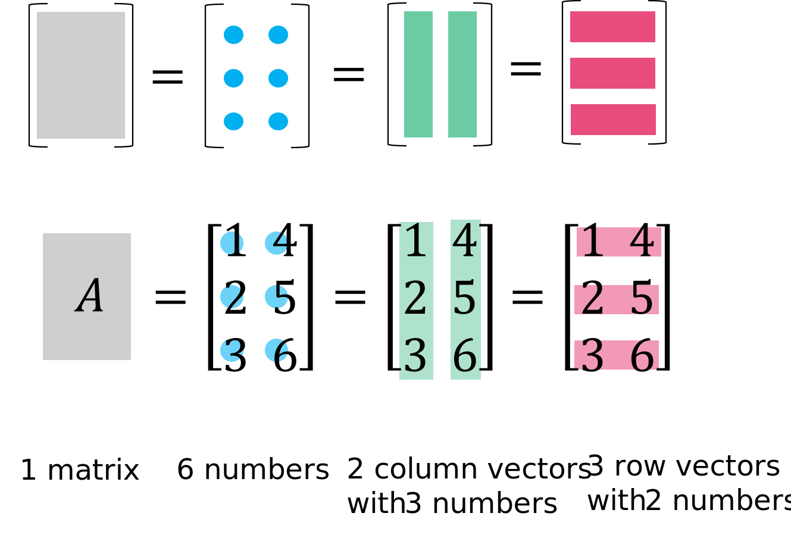

# 📝Definition
- A matrix is a rectangular array of numbers, e.g.
    - $$
      \begin{bmatrix}
      0&1&-2.3&0.1\\
      1.3&4&-0.1&0\\
      4.1&-1&0&1.7
      \end{bmatrix}
      $$
    
- A matrix ($m \times n$) can be seen as $1$ matrix, $mn$ numbers, $n$ columns and $m$ rows.
    - the column vectors are in bold as $\mathbf{a_1}$.
    - Row vectors include $\mathbf{*}$ as in $\mathbf{a_1^*}$.
    - Transposed vectors and matrices are indicated by $\mathrm{T}$ as in $\mathbf{a}^T$ and $A^T$.
    - $$A= \begin{bmatrix}
          a_{11} & a_{12}\\
          a_{21} & a_{22}\\
          a_{31} & a_{32}
        \end{bmatrix}
        =
        \begin{bmatrix}
          | & |\\
          \mathbf{a_1} & \mathbf{a_2}\\
          | & |
        \end{bmatrix}
        =
        \begin{bmatrix}
        - \mathbf{a_1^*} -\\
        - \mathbf{a_2^*} -\\
        - \mathbf{a_3^*} -
        \end{bmatrix}
        $$
        
# 🧠Intuition
- When encounter a matrix, you should immediately be aware ==**what the row and column means**==.

# 📈Diagram
- Viewing a Matrix – 4 Ways
    - 
    
# 🎯Intent
- In computer graphic,
    - It means to cover calculation between different Cartesian coordinate spaces.
    
# 🧪Composition
- Suppose $A$ is an $m\times n$ matrix with entries $A_{ij}$ for $i=1,...,m,\space j=1,...,n$
- 📌Column ^22608a853b87cf2e
    - Its $j$th column is the $m$-vector
    - $$
      \begin{bmatrix}
      A_{1j}\\\vdots\\A_{mj}
      \end{bmatrix}
      $$
    
- 📌Row
    - Its $i$th row is the $n$-row-vector.
    - $$
      \begin{bmatrix}
      A_{i1}&\cdots&A_{in}
      \end{bmatrix}
      $$
    
- 📌Slice of Matrix
    - $A_{p:q,r:s}$ is the $(q-p+1)\times (s-r+1)$ matrix
    - $$
      A_{p:q,r:s}=
      \begin{bmatrix}
      A_{pr}&A_{p,r+1}&\cdots&A_{ps}\\
      A_{p+1,r}&A_{p+1,r+1}&\cdots&A_{p+1,s}\\
      \vdots&\vdots&\space&\vdots\\
      A_{qr}&A_{q,r+1}&\cdots&A_{qs}\\
      \end{bmatrix}
      $$
    
# ✒Notation
**⚠==Warning==**
- You should be aware there is a huge difference between "math notation" and "computer science notation" of Matrix.

- 📌General Notation
    - $$
      M_{ij} = \begin{bmatrix}
      F_{11}&F_{12}&F_{13}&F_{14}\\
      F_{21}&F_{22}&F_{23}&F_{24}\\
      F_{31}&F_{32}&F_{33}&F_{34}\\
      \end{bmatrix}
      $$ 
    - where $i$ and $j$ represents $i$-th row of the $j$-th column. In this case, $i=3,j=4$
    
- 📌Column picture of matrix
    - An $m\times n$ matrix $A$ can express as block matrix with its ($m$-vector) columns $a_1,...,a_n$
    - $$
      A = \begin{bmatrix}
      a_1&a_2&\cdots&a_n
      \end{bmatrix}
      $$
    - 💡a.k.a The $a_1$ you saw is not just a number, but a $m$-vector(column) ==stacked== into $a_1$. It could be exploded ==vertically==.
    
- 📌Row picture of matrix
    - An $m\times n$ matrix $A$ can express as block matrix with its ($n$-row-vector) columns $b_1,...,b_m$
    - $$
      A = \begin{bmatrix}
      b_1\\b_2\\\vdots\\b_m
      \end{bmatrix}
      $$
    - 💡a.k.a The $b_1$ you saw is not just a number, but a $n$-vector(row) ==squeezed== into $b_1$. It can be exploded ==horizontally==.
    
# ⛈Characteristics / Properties
- 📌size
    - The size is given by (row dimension) $\times$ (column dimension).        
- 📌 [[scalar]]-matrix arithmetic operation properties
    - Given any two scalars $a$ and $b$ and any three $m\times n$ matrices $F$, $G$, and $H$, the following properties hold.
    - $$
      F+G=G+F\\
      (F+G)+H = F+(G+H)\\
      a(bF)=(ab)F\\
      a(F+G) = aF+aG\\
      (a+b)F = aF+bF\\
      (F+G)^T=F^T+G^T
      $$

- 📌 [[matrix rank]]
- 📌 [[scalar]]-matrix-matrix arithmetic operation properties
    - Given any scalar $a$, an $n\times m$ matrix $F$, an $m\times p$ matrix $G$, and a $p\times q$ matrix $H$, the following properties hold.
    - $$
      (aF)G = a(FG)\\
      (FG)H = F(GH)\\
      (FG)^T = G^TF^T
      $$
- 📌Invertible
    - 📝Definition
        - An $n\times n$ matrix $M$ is *invertible* if and only if the columns of $M$ form a [[linear independent]] set. Equivalently, $M$ is invertible if and only if the [[Determinant]] of $M$ $\bold{det}M≠0$ .
        
    - 🔎Implementation
        - See [[#Matrix Inverse|Matrix Inverse]]
        
    - 📏Theorem & Proof
        - Theorem
            - A matrix possessing a row or column consisting **entirely of zeros** is **not invertible**.
            
        - Theorem
            - A matrix $M$ is *invertible* if and only if $M^T$ is invertible.
            
        - Theorem
            - If $F$ and $G$ are $n\times n$ invertible matrices, then the product $FG$ is invertible, and $(FG)^{-1}=G^{-1}F^{-1}$.
            
- 📌Singular
    - Matrix is not invertible is called singular.
    
- 📌Symmetric
    - 📝Definition
        - An $n\times n$ matrix $M$ is *symmetric* if and only if $M_{ij}= M_{ji}$  for all $i$ and $j$. That is, a matrix whose entries are symmetric about the main diagonal is called symmetric.
- 📌 [[column space]]            
- 📌Matrix Norm
    - 📝Definition
        - For $m\times n$ matrix A, we define
        - $$
          \lVert A\rVert=\bigg(\sum_{i=1}^{m}\sum_{j=1}^{n}A_{ij}^2\bigg)^{1/2}
          $$
    - ⛈Characteristics / Properties
        - satisfies norm properties:
        - $$
          \lVert\alpha A\rVert=\lvert a\rvert \lVert A\rVert\\
          \lVert\alpha A+B\rVert \leq \lVert A\rVert+\lVert B\rVert\\
          \lVert A\rVert\geq0\\
          \lVert A\rVert=0\text{ only if }A=0
          $$
        
# 💫Support Operation
- 📌Complexity of Matrix operation
    - Suppose $m\times n$ matrix $A$.
    - Storage.
        - stored $A$ as $m\times n$ array of numbers. For sparse $A$, store only $\bold{nnz}(A)$ nonzero values.
        
    - Matrix Addition and Subtraction
        - It costs $mn$ [[Floating Point#^ca24a0a87b9f40a1|flops]].
        
    - Matrix-Vector multiplication
        - It costs $m(2n-1)\approx2mn$ [[Floating Point#^ca24a0a87b9f40a1|flops]]. (for sparse $A$, around $2\bold{nnz}(A)$ [[Floating Point#^ca24a0a87b9f40a1|flops]])
        
## 📌Matrix Inverse
- 📋Prerequisite
    - A matrix $M^{-1}$ is the inverse of $M$, such that
        - $$
          MM^{-1}=M^{-1}M=I
          $$
        - where $I$ is the [[identity matrix]].
        
- 📝Definition
    - Suppose
        - $F$ is a $n\times n$ matrix
        - $G$ is $F$'s inverse. (sometime also denoted as $F'$)
        
    - Then the ==**entries**== of the inverse $G$ of an $n\times n$ matrix $F$ can be calculated by using the explicit formula
        - $$
          \begin{align}
          G_{ij} = \frac{1}{\bold{det}(F)}C_{ji}(F)
          \end{align}
          $$
        - where $\bold{det}$ is the [[Determinant]].
        - where $C$ is the [[#^5cd25e079d5be40e|cofactor matrix]].
        
- 🗃Example
    - 📌example of the matrix inverse of a $2\times2$ matrix $A$.
        - Suppose matrix $A$ is
            - $$
              A=
              \begin{bmatrix}
              A_{11}&A_{12}\\A_{21}&A_{22}
              \end{bmatrix}
              $$
            
        - Then the inverse of $A$ is $A^{-1}$ is given by
            - $$
              \begin{align}
              A^{-1}=\frac{1}{\text{det}A}\begin{bmatrix}A_{22}&-A_{12}\\-A_{21}&A_{11}\end{bmatrix}
              \end{align}
              $$
            
        - Notice the negative sign in $A_{12}$ and $A_{21}$. That is because $C_{ij}(M)\equiv(-1)^{i+j}M^{\{i,j\}}$. $1+2$ and $2+1$ are odd, so $(-1)$ is still negative.
        
## 📌Addition and Subtraction
- We can add or subtract matrices of the same size:
    - $$
      (A + B)_{ij} = A_{ij} + B_{ij},\quad i = 1,...,m\quad j = 1,...,n
      $$
    
## 📌 [[scalar]] multiplication
$$
(\alpha A)_{ij}=aA_{ij},\quad i = 1,...,m\quad j = 1,...,n
$$
       
## 🌌 [[Matrix-Vector Products]]
## 🥏[[matrix multiplication|matrix product]]
## 🌀[[transpose]]
# 🏷(Sub)Categories
- 📌Zero Matrix
    - $m\times n$ zero matrix has all entries zero, written as $0_{m\times n}$ or just $0$.
- 📌[[identity matrix]]
- 📌 [[Sparse Matrix]]
- 📌[[square matrix]]
- 📌Tall Matrix
    - An $m\times n$ matrix $A$ is square if $m>n$.
- 📌Wide Matrix
    - An $m\times n$ matrix $A$ is square if $m<n$.
- 📌 [[Incidence Matrix]]
- 📌Minor of Matrix ^b0ee7456219cb803
    - 📝Definition
        - A minor $M_{ij}$ is formed by omitting the $i$th row and $j$th column of a matrix $A$.
        
    - 🗃Example
        - example - The minor $M_{22}$ of the matrix is given by.
            - 
            - 
            
        - example - the minor $M_{23}$
            - It is given by
            - $$
              \begin{align}
              M=
              \begin{bmatrix}
              1&2&3\\
              4&5&6\\
              7&8&9\\
              \end{bmatrix}
              \\
              M^{\{2,3\}}=
              \begin{bmatrix}
              1&2\\
              7&8\\
              \end{bmatrix}
              \end{align}
              $$
            
- 📌Cofactor Matrix ^5cd25e079d5be40e
    - 📋Prerequisite
        - First understand the essence of "cofactor". Given a factor $a$ of a number $n=ab$, the cofactor of $a$ is $b=n/a$.
        
    - 📝Definition
        - A cofactor matrix is a signed version of a [[#^b0ee7456219cb803|minor]] $M_{ij}$ defined by
            - $$C_{ij}\equiv(-1)^{i+j}M_{ij}$$
    - 🧀Applicability
        - Used in the computation of the [[Determinant]] of a matrix.
- 📌[[band matrix]] 
- 📌 [[tridiagonal matrix]]
- 📌 [[upper triangular matrix]]
- 📌 [[lower triangular matrix]]
- 📌 [[triangular matrix]]
- 📌 [[diagonal matrix]]
- 📌 [[skew-symmetric matrix]]
- 📌[[rank one matrix]]
- 📌 [[orthogonal matrix]]
- 📌 [[augmented matrix]]
        
# 🧀Applicability
- 📌Matrix Representation
    - image
        - We can use matrix $X$ to represent an image. $X_{ij}$ is $i, j$ pixel value in a monochrome image.
        
    - rainfall data
        - We can use matrix $A$ to represent a rain fall data.
        - The row is a bunch of location(Shanghai, Beijing, Boston) and the columns is the day(Day1, Day2, Day365).
        - $A_{ij}$ is rainfall at location $i$ on day $j$
        
    - multiple asset returns
        - We can use matrix $R$ to represent asset returns.
        - The row is the period, e.g. 1st quarter, 3rd quarter. The column is the asset type, e.g. stock, house renting revenue...
        - $R_{ij}$ is return of asset $j$ in period $i$.
        
    - contingency table: $A_{ij}$ is number of objects with first attribute $i$ and second attribute $j$
    - feature matrix: $X_{ij}$ is value of feature $i$ for entity $j$
    
- 📌 [[Graph]]
    - We can use matrix to denote a graph or a relation. A directed graph can be represented as $m\times n$ matrix with $A_{ij}=1$ if $(i,j)\in R$. $R$ is the relation.
    - ![[Graph#^fab4c9b58e3e75b1]]
    - For preceding graph, ^471fd6ee9a6d8360
        - it can be represented as $6\times6$ matrix as followed.
        - $$
          \begin{bmatrix}
          0 & 1 & 0 & 0 & 0 & 0 \\
          1 & 0 & 0 & 1 & 0 & 0 \\
          0 & 0 & 0 & 0 & 0 & 0 \\
          0 & 0 & 0 & 0 & 0 & 0 \\
          0 & 0 & 0 & 1 & 0 & 1 \\
          1 & 0 & 1 & 0 & 0 & 0 
          \end{bmatrix} 
          $$
        - $A_{2,4}=1$ means there is a directed edge from $2$ to $4$.
        - $A_{3,6}=0$ means there is no directed edge from $3$ to $6$.
        - $A_{6,3}=1$ means there is a directed edge from $6$ to $3$.
        
# 🌓Complement

# ⌨Sample Code
- 📌Matrix Representation
    - ``` julia
      julia> A = [0.0 1.0 -2.3 0.1;
                  1.3 4.0 -0.1 0.0;
                  4.1 -1.0 0.0 1.7]
      3×4 Matrix{Float64}:
       0.0   1.0  -2.3  0.1
       1.3   4.0  -0.1  0.0
       4.1  -1.0   0.0  1.7
      ```
    
- 📌Matrix-Matrix Product
    - Python
        - ```python
          >>> import numpy as np
          >>> F = np.array([[2,3,1],
                            [3,0,1]])
          >>> G = np.array([[1,2],
                            [4,0],
                            [3,2]])
          >>> F@G
          array([[17,  6],
                 [ 6,  8]])
          ```
        
    - Julia
        - ``` julia
          julia> F = [2 3 1;
                      3 0 1]
          2×3 Matrix{Int64}:
           2  3  1
           3  0  1
          
          julia> G = [1 2;
                      4 0;
                      3 2]
          3×2 Matrix{Int64}:
           1  2
           4  0
           3  2
          
          julia> F*G
          2×2 Matrix{Int64}:
           17  6
            6  8
          ```
        
