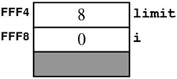
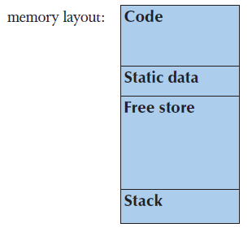
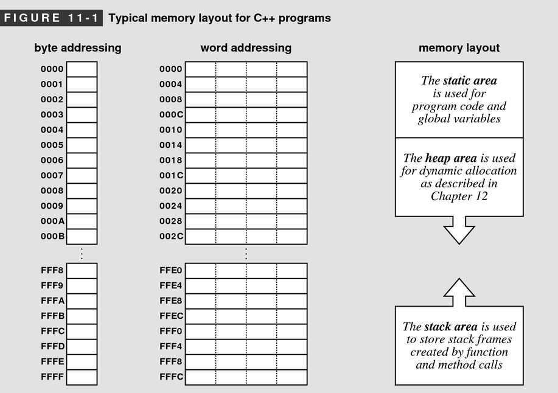
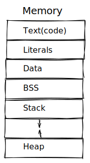

# 📝Definition
- In a typical machine, that memory is built out of special integrated-circuit called RAM, which stands for random-access-memory.
- The computer's memory is a [[Tuple|sequence]] of [[Byte|bytes]] numbered from $0$ to the memory size minus $1$.

# 🎯Intent
- For programmer, we should be aware of how the memory is organized.


# 📈Diagram

```cpp
int var = 17;
int* ptr = &var;
```
In the preceding diagram,
- the `ptr` is variable which holds an address in the memory.
- `4096` is an address which held by the `ptr` variable.
- `4096` is the $(2^{12}+1)$-th address of the memory. The value stored at `4096+1`-th address is `17`.
> [!tip] Idea
> `ptr` is a variable which holds an arrow. That arrow points to a place in memory.


# ⛈Properties
## Memory Address
### 📝Definition
Within the memory system of a typical computer, every [[Byte|byte]] is identified by a numeric ==**address**==.
The 1st byte in the computer is numbered 0, the 2nd is numbered 1, and so on, up to the number of bytes in the machine minus 1.
### ✒Notation
Address numbers are conventionally written in [[hexadecimal]].

> [!NOTE] Note
> Address用16进制只是一种表现形式，其核心还是排序，e.g.第几个地址。

### 🗃Example
The memory addresse in a tiny 64KB computer.
- index of beginning byte: 0 ---to hexadecimal---> `0`
- index of ending byte: 65,535 ---to hexadecimal---> `FFFF`

### 📈Diagram
The following diagram demonstrates the memory address(`FFF4`, `FFF8`).

> [!NOTE] Note
> The gray rectangle at the bottom of the diagram indicates that the computer will need to keep track of additional information about each function call beyond the values of the local variables.


## Memory Layout
### 📝Definition
Regarding memory layout, there are different sayings. Since Bjarne is the designer of #cpp , I would rather prefer those.


### 📈Diagram
📌View from #BjarneStroustrup 


📌View from #EricRoberts


📌View from #Saks



### 🧪Composition
The memory is organized as followed from top to bottom.

#### code storage / text storage
The compiler sets aside the ==instructions== of the program in code storage.

#### static area
Static area stores ==global variables==. 

> [!NOTE] Note
> The amount of memory allocated in this region typically does not change as the program runs.


#### stack area / automatic storage
Space for ==function arguments and local variables== is called [[Stack|stack area]].

#### heap area
The region of memory between the end of the program data and the stack is called the [[Heap|heap area]]. This region is potentially available for other uses, it is “==free==”.

___
- Code generators and linkers usually separate entities into different program section, such as:
    - "text" or "code" for machine instruction
    - "literal" for initialized read-only data
    - "data" for initialized read-write data
    - "bss" for uninitialized read-write data
    
- The [[Linker]] is responsible for arranging these sections in memory. User can use "linker script" to do that.
  

- Controlling Memory Map
    - This can benefit the embedded system which has objects declared at different space.
    - {:height 300, :width 300}
