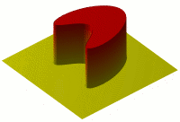
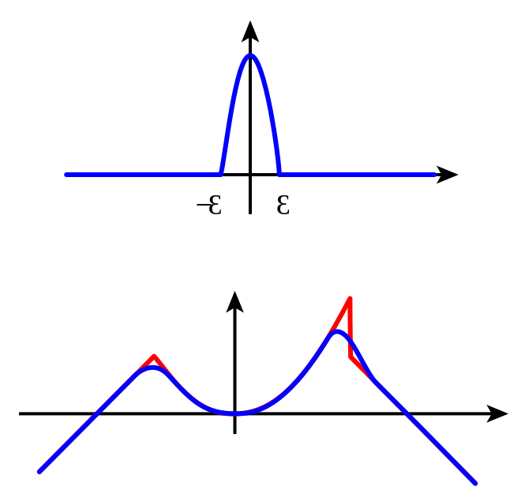

# 📝Definition
Mollifiers (also known as approximations to the identity) are smooth functions with special properties, used for example in distribution theory to create sequences of smooth functions approximating nonsmooth (generalized) functions, via convolution.

# 🧠Intuition
Mollifier makes an irregular function smoother(get mollified).

- Top: A mollifier in dimension one. 
- Bottom: In red is a function with a corner (left) and sharp jump (right), and in blue is its mollified version.

# ✒Notation
Suppose $\varphi$ is a smooth function on $\mathbb{R}^n, n \geq 1$, it is a **mollifier** when it satisifes the following:
- 1️⃣ it is [[support|compactly supported]]
- 2️⃣ $\int _{\mathbb {R} ^{n}}\!\varphi (x)\mathrm {d} x=1$
- 3️⃣ $\lim _{\epsilon \to 0}\varphi _{\epsilon }(x)=\lim _{\epsilon \to 0}\epsilon ^{-n}\varphi (x/\epsilon )=\delta (x)$
where
- $\delta (x)$ is the [[Dirac delta function]]
- the limit must be understood in the space of Schwartz distributions

# 🏷Categories
Mollifiers satisfy the particular condition can be categorized followed.

## 🔖positive mollifier
It is called a **positive mollifier** when
$$
\varphi (x) \geq 0 \text{ for all } x \in \mathbb{R}^n
$$

## 🔖symmetric mollifier
It is called a **symmetric mollifier** when
$$
\varphi(x)=\mu(|x|) 
$$
for some infinitely differentiable function
$$
\mu  : \mathbb{R}^{+}\to\mathbb{R}.
$$

# 🗃Example
Example is the most straightforward way to understand a mathematical concept.

# 🌱Related Elements
The closest pattern to current one, what are their differences?

# 🍂Unorganized