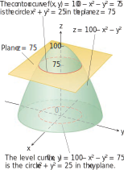

# 📝Definition

## 📄multivariable function
A function is called **multivariable** if its [[domain|input]] is made up of multiple numbers.
$$
f(\underbrace{x,y}_{})=x^2y
$$
## 📑function of 2 variables
A function of 2 variables, defined on the domain $D$ in the [[plane]], is a rule $f$ that associates with each point $(x, y)$ in $D$ a unique real number, denoted by
$$
f (x, y).
$$

## 📑function of 2 variables(rigorous)
A function $f$ of 2 variables is a rule that assigns to each ordered pair of real numbers $(x,y)$ in a set $D$ a unique real number denoted by
$$
f (x, y).
$$
The set $D$ is the [[domain]] of $f$ and its [[range]] is the set of values that $f$ takes on, that is
$$
\left\{f(x,y) | (x,y)\in D \right\}.
$$

## 📃function of 3 variables
A function of 3 variables, defined on the domain $D$ in space, is a rule $f$ that associates with each point $(x, y, z)$ in $D$ a unique real number, denoted by
$$
f (x, y, z).
$$

___
The relationship between domain and range is represented as set. More formally, it is [[level set]].

# 🧠Intuition
Find an intuitive way of understanding this concept.

# 🎨Representation
> [!info] Remark
> This section describe how to "graph" these multivariable functions.

## Functions of 2 Variables
There are ==**2**== standard ways to picture the values of a function $f(x, y)$.
- 1️⃣One is to draw and label curves in the domain on which $f$ has a constant value. (a.k.a. [[level curve]])
- 2️⃣The other is to sketch the [[surface]] $z = f(x, y)$ in space.

## Functions of 3 Variables

# 🗃Example
- 📁analyze domain and range of multivariable function example
	- 💬Question: For each of the following functions, evaluate $f(3, 2)$ and find and sketch the domain.
		- $f(x,y)=\frac{\sqrt{x+y+1}}{x-1}$
		- $f(x,y)=x\ln(y^2-x)$
	- ✏Solution:
		- for $f(x,y)=\frac{\sqrt{x+y+1}}{x-1}$
			- $f(3,2)=\frac{\sqrt{x+y+1}}{x-1}=\frac{\sqrt{3+2+1}}{3-1}={\sqrt{6}\over2}$
			- The expression for $f$ makes sense if the denominator is not 0 and the quantity under the square root sign is nonnegative. So the domain of $f$ is
				- $$D=\{(x,y)|x+y+1\geq0,x\neq1\}$$
			- The inequality $x + y + 1 \geq 0$, or $y \geq -x- 1$, describes the points that lie on or above the line $y = − x- 1$, while $x \neq 1$ means that the points on the line $x = 1$ must be excluded from the domain.
			- 
		- for $f(x,y)=x\ln(y^2-x)$
			- $f(3,2)=3\ln(2^2-3)=0$
			- Since $(y^2-x)$ lies in logarithm and therefore $(y^2-x)>0$. that is, $x < y^2$, the domain of $f$ is
				- $$D=\{(x,y)|x<y^2\}$$
			- 

- 📁graph multivariable function example
	- 💬Question: Graph $f(x, y) = 100 - x^2 - y^2$ and plot the level curves $f(x, y) = 0, f(x, y) = 51$, and $f(x, y) = 75$ in the domain of $f$ in the plane.
	- ✏Solution:
		- domain
			- The domain of $f(x,y)$ is the whole $xy$-plane.
		- range
			- The range of $f(x,y)$ is the the set of real numbers $\leq100$.
		- level curve $f(x, y) = 0$
			- The level curve $f(x, y) = 0$ is the set of points in the $xy$-plane at which
				- $f(x,y)=0=100-x^2-y^2\quad\text{or}\quad x^2+y^2=100$
				- which is the circle of radius 10 centered at the origin.
		- level curve $f(x, y) = 51$
			- $f(x,y)=51=100-x^2-y^2\quad\text{or}\quad x^2+y^2=49$
		- level curve $f(x, y) = 75$
			- $f(x,y)=75=100-x^2-y^2\quad\text{or}\quad x^2+y^2=25$
		- diagram
			- 
		- 

# 🌱Related Elements
The closest pattern to current one, what are their differences?

# 🍂Unorganized