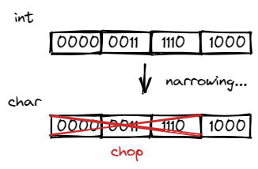

alias:: narrowing conversion, coercion

- # 😎Quick Digest -> narrowing
	- ## 📝Definition
	  A "narrowing" cast is the exact opposite of "widening" (`long` to `int`). A narrowing cast introduces the possibility of [[overflow]].
	- ## 🎯Intent
	   A short description what does this thing do?
		- Why do people accept the problem of narrowing conversions even though it is a main reason cause unsafe conversion?
			- The major reason is history: C++ inherited narrowing conversions from its ancestor language, C, so from day one of C++, there existed much code that depended on narrowing conversions. In the meantime, the problems with unsafe conversions are often manageable in small programs and for experienced programmers. Think about the "bit" at that time...
	- ## 🧠Intuition
	  Find an intuitive way of explanation of this concept.
		- Narrowing relates to [[Bit]]
		  id:: 6310049f-38c7-4bb1-8319-52ff81e43f9b
			- ``` c++
			  int a = 1000;
			  char b = a;
			  ```
			- {:height 151, :width 233}
	- ## 🚀Benefit
	   A scenario that illustrates the benefit this object provides.
	- ## ⌨Sample Code
	   Code fragments
		- example of preventing narrowing in C++
			- used [[{} - initialization syntax]]
				- see [here](((630eca65-19f9-43ab-a15c-788af07093ab)))
			- used `narrow_cast<..>()` to prevent
				- ``` c++
				  int x1 = narrow_cast<int>(2.9); // narrowing occurs! ⚠throws
				  int x2 = narrow_cast<int>(2.0); // OK
				  char c1 = narrow_cast<char>(1066); // narrowing occurs! ⚠throws
				  char c2 = narrow_cast<char>(85); // OK
				  ```
	- ## 🌓Complement
	  [[widening]]
	- ## 🤳Applicability
	   What are the situations in which this subject can be applied?
	- ## 🧪Composition
	  What kind of stuffs composite this subject?
	- ## 🏷(Sub)Categories
	  What are the sub objects of this subject?
	- ## 🔎Implementation
	   The code or technical stuffs implement this.
	- ## 🕳Pitfalls
	  Be aware of the pitfalls when using this stuffs... (especially considering edge cases)
	- ## 🙋‍♂️Related Elements
	   The closest pattern to current one, what are their differences?
	- ## 🥼Expert's Advice
	- ## 🧱Structure
	  Any other hierarchical issues?