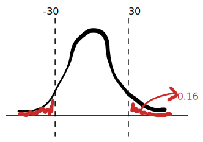

# 📝Definition
The normal distribution is
$$
p(x) = \frac{1}{\sigma \sqrt{2\pi }} e^{\frac{-(x-\mu )^2}{2\sigma ^2}}
$$
The interpretation on the symbols are different.
- $\mu$ - [[mean|expected value]], [[mean]]
- $x$ - [[Glossary#variate|variate]]
- $\sigma$ - [[standard deviation]]
- $\sigma^2$ - [[variance]]

# 🎯Intent
The normal distribution is used to compute probabilities across all sciences, social sciences, and engineering, for example in measurements in #astronomy, #biology , #chemistry , or #physics  . You may have seen it used for grades on an exam, or with respect to heights or weights of people in a population.

# 🗃Example
- 📌normal distribution
	- 💬Question:
		- Jen had an algebra class at university where each question was True-or-False. If you got a question correct, you got $+1$ point. If you got a question wrong, you got $-1$ point. There were $100$ questions. The distribution of exam scores was normal and given by the normal distribution.
		- $$\frac{1}{30\sqrt{2\pi }} e^{-x^2/1800}.$$
		- If the probability that a student gets a score of 30 points or higher is $0.16$, what is the probability that a student scores between -30 and 0 points?
	- 🏹Strategy:
		- The question seems complicated at the first glance. while it is super easy! We must remember that a normal distribution is [[Function#^49e41254c30b3ba8|even function]].
	- ✏Solution:
		- Draw the diagram
			- 
			- Therefore the probability is $1\cdot\frac{1}{2}-0.16=0.32$

- 📌Normal distribution
	- 💬Question:
		- The expected lifetime of a battery in a smoke detector is 12 months with a standard deviation of 1 month. The formula for the normal distribution is $$\large { p(t) = \frac{1}{\sigma \sqrt{2\pi }} e^{-\frac{(t-\mu )^2}{2\sigma ^2}} = C e^{-\frac{(t-\mu )^2}{2\sigma ^2}}}.$$
	- 🏹Strategy: From the given info, fill the variables.
	- ✏Solution:
		- $\mu$ - expected value
			- That is 12.
		- $\sigma$ - standard deviation
			- That is 1.
		- $\sigma^2$ - variance
			- That is 1.
		- Then the distribution is
			- $$p(t) = \frac{1}{\sqrt{2\pi }}e^{-(t-12)^2/2}.$$
		- The probability can be seen as $1-P(12)$
			- $$1-\int_0^{12}p(t)=1-0.5=0.5$$
 

# 🔗Link
https://mathworld.wolfram.com/NormalDistribution.html
