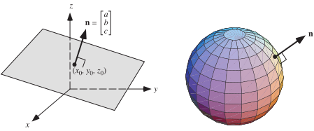

https://mathworld.wolfram.com/NormalVector.html
# 📝Definition
The normal vector to a [[surface]] is a [[vector]] which is perpendicular to the surface at a given point. 

> [!info] Remark
> When normals are considered on closed surfaces, the inward-pointing normal (pointing towards the interior of the surface) and outward-pointing normal are usually distinguished.

# 🧠Intuition
Find an intuitive way of understanding this concept.

# 🗃Example
Example is the most straightforward way to understand a mathematical concept.

# 🌱Related Elements
The closest pattern to current one, what are their differences?

# 🍂Unorganized