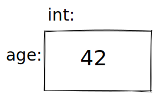
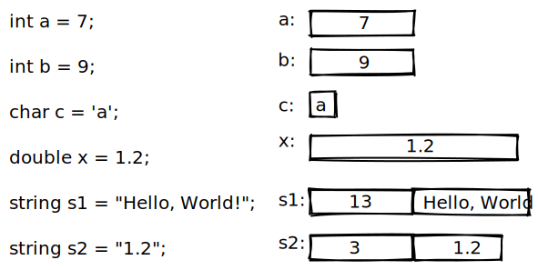

# 📝Definition
An object is a region of memory with a [[type]] that specifies what kind of information can be placed in it.

# 🧠Intuition
Find an intuitive way of explanation of this concept.
- Think of an object as a "box" into which you can put a value of the object's [[type]].
  {:height 81, :width 122}

# 🙋‍♂️Related Elements
 The closest element to current one, what are their differences?
- 📌Relationship between [[type]]-object- [[value]]- [[variable]]- [[Declaration]]- [[Definition]] ⭐
    - relationship:
        - • A **type** defines a set of possible values and a set of operations (for an object).
          • An **object** is some memory that holds a value of a given type.
          • A **value** is a set of bits in memory interpreted according to a type.
          • A **variable** is a named object.
          • A **declaration** is a statement that gives a name to an object.
          • A **definition** is a declaration that sets aside memory for an object.
        
    - Diagram:
        - {:height 198, :width 390}
        - 1 byte for `bool`, `char`
        - 4 byte for `int`
        - 8 byte for `double`
        - the first spot is for a `string` keeps track of the number of characters it holds
        